# Grandpa

## Overview

- **OS:** Windows Server 2003 R2
- **IP:** 10.129.95.233
- **Difficulty:** Easy
- **Platform:** HackTheBox

### Summary

Grandpa runs Microsoft IIS 6.0 on Windows Server 2003 with WebDAV enabled, exposing CVE-2017-7269 - a buffer overflow in the `ScStoragePathFromUrl` function of the WebDAV service. Exploitation via Metasploit's `iis_webdav_scstoragepathfromurl` module gave a Meterpreter shell as `NT AUTHORITY\NETWORK SERVICE`. Privilege escalation to SYSTEM was achieved with MS10-015 (KiTrap0D), but only after migrating Meterpreter into a stable `w3wp.exe` process - the post-exploit context was too unstable for the local exploit to query the session SID and inject directly.

## Enumeration

### Nmap Scan

Started with a service and version scan.

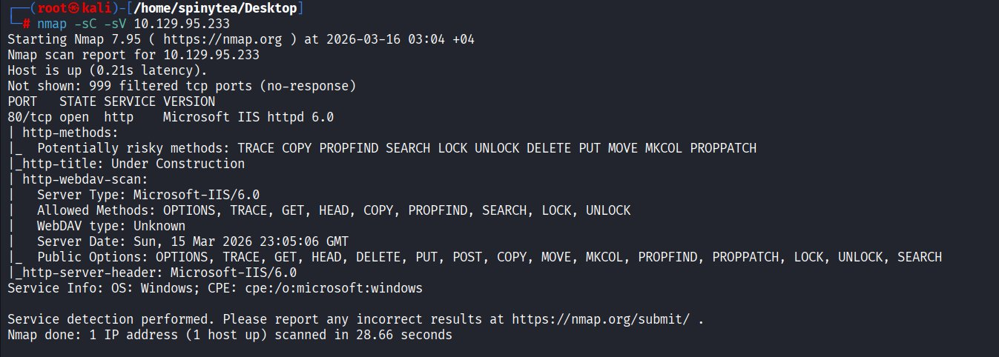

Only port 80 is open, but the WebDAV scan output is the prize. Microsoft IIS 6.0 with WebDAV enabled and risky methods (PUT, MOVE, PROPFIND, PROPPATCH, LOCK, etc.) is the signature of **CVE-2017-7269** - a buffer overflow triggered by a long `If: <http://` header in a PROPFIND request.

### CVE Reference

Pulled up the NIST entry to confirm.

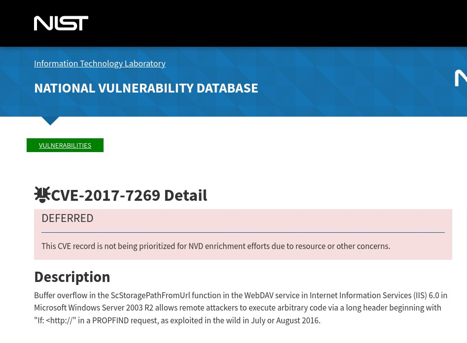

Buffer overflow in the ScStoragePathFromUrl function in the WebDAV service in IIS 6.0 on Windows Server 2003 R2, allowing remote code execution via a long header beginning with `If: <http://` in a PROPFIND request. Exploited in the wild in 2016.

Also pulled the Exploit-DB entry (EDB-ID 41738) which references the same CVE.

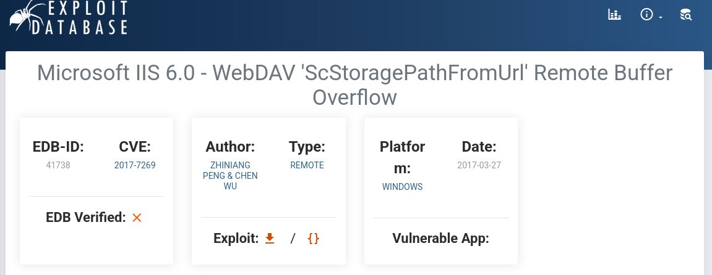

## Vulnerability Research

Searched Metasploit for IIS WebDAV modules to find the right one.

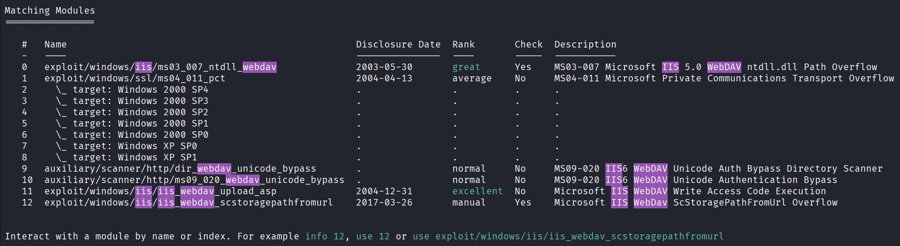

The relevant one is the last entry - `exploit/windows/iis/iis_webdav_scstoragepathfromurl`. The older modules in the list target IIS 5.0 and MS09-020, which don't apply to IIS 6.0.

## Exploitation

### First Attempt (Unstable)

Loaded the module and ran it.

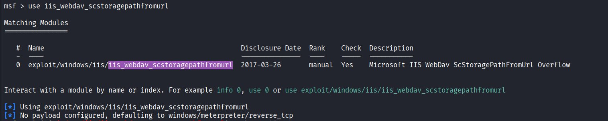

Got a Meterpreter session, but it was visibly damaged - `getuid` and `sysinfo` both failed with "Access is denied". Only `pwd` worked, returning `c:\windows\system32\inetsrv`.

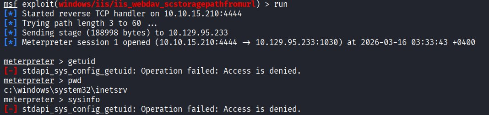

This is well-documented for ScStoragePathFromUrl - the shellcode runs inside the IIS worker process, but the buffer overflow leaves the process in a broken state with corrupted handle tables. The session was abandoned.

### Re-exploiting Cleanly

Re-ran the same module and got a stable session this time.

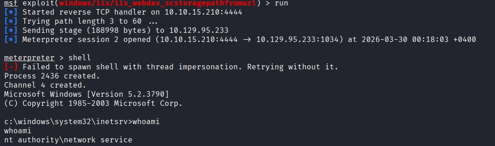

Dropped to a shell with `shell`, confirmed running as `nt authority\network service`. System identifies as Microsoft Windows Version 5.2.3790 - Windows Server 2003 SP2. Low-privilege account, but the shell is functional.

## Privilege Escalation

### local_exploit_suggester

Backgrounded the session and ran the suggester to enumerate viable local exploits.

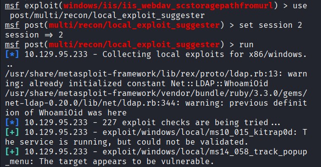

After 227 exploit checks, six candidates came back as potentially vulnerable:

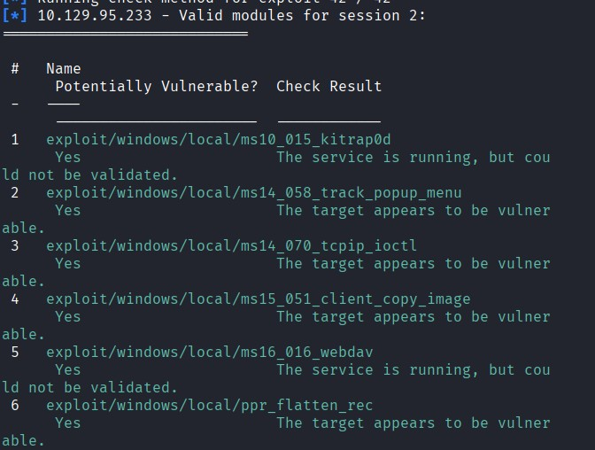

- `ms10_015_kitrap0d` - kernel #GP trap handler
- `ms14_058_track_popup_menu` - win32k driver flaw
- `ms14_070_tcpip_ioctl` - tcpip.sys vulnerability
- `ms15_051_client_copy_image` - win32k.sys
- `ms16_016_webdav` - WebDAV client elevation
- `ppr_flatten_rec` - PPR flatten registry

### False Start (Wrong Module)

First attempt picked option `3` from the suggester output, expecting `ms14_070_tcpip_ioctl`. Wrong - the numbering in the suggester is display-only and `use 3` picks whatever's at the global module index 3, which turned out to be `exploit/windows/firewall/blackice_pam_icq`. Completely unrelated to local privesc.

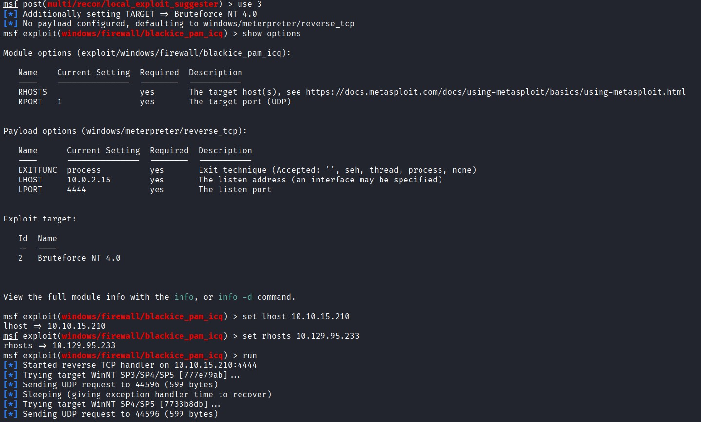

The module ran against the wrong product (BlackICE PC Protection firewall on Windows NT) and predictably failed. Lesson: always use the full module path after `local_exploit_suggester`, never the numeric index.

### MS10-015 (KiTrap0D)

Switched to the correct module. MS10-015 exploits a flaw in the Windows kernel's `#GP` trap handler to elevate any low-priv account to SYSTEM. Supports every 32-bit Windows from 2000 SP4 through Windows 7.

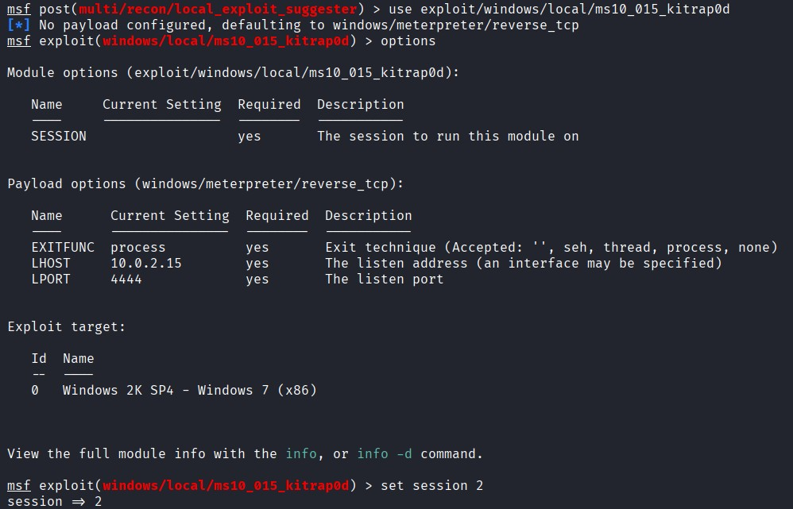

First run failed:

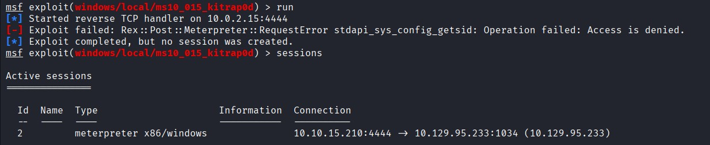

`stdapi_sys_config_getsid: Operation failed: Access is denied`. The local exploit needs the session SID before injecting its kernel payload, and the unstable NETWORK SERVICE context refused the query - same `stdapi` failure pattern as the initial Meterpreter session.

### Process Migration

Fix is to migrate Meterpreter into a stable x86 process running under the same account.

Listed processes to find a target.

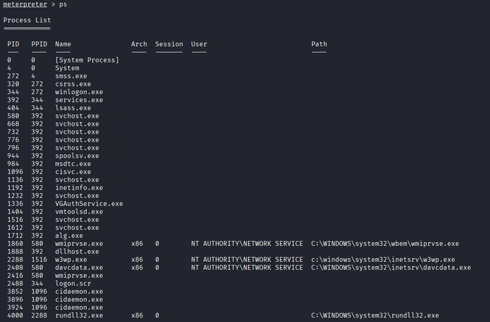

`w3wp.exe` (PID 2288) - the IIS worker process. Runs as NETWORK SERVICE (same account, no credential prompt), x86, stable handle table.

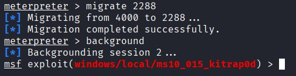

Migration completed successfully. Backgrounded the session and re-ran KiTrap0D.

### Successful Escalation

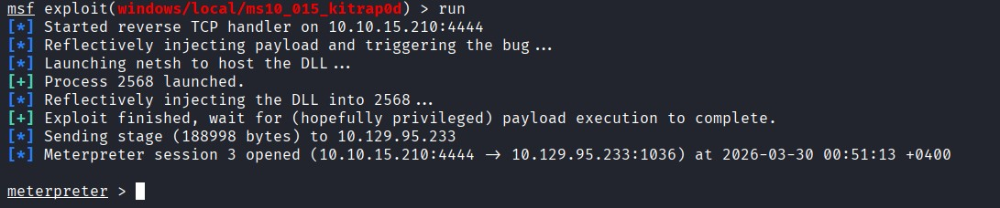

KiTrap0D reflectively injected the payload into a freshly spawned `netsh.exe` (PID 2568), triggered the kernel bug, and a new Meterpreter session opened. Dropped to a shell and confirmed:

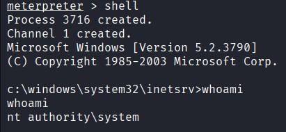

`nt authority\system`.

## User Flag

Listed C:\ to find user profiles.

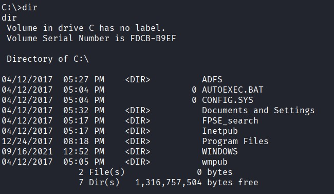

`user.txt` sits on Harry's Desktop - the only standard user account on the box.

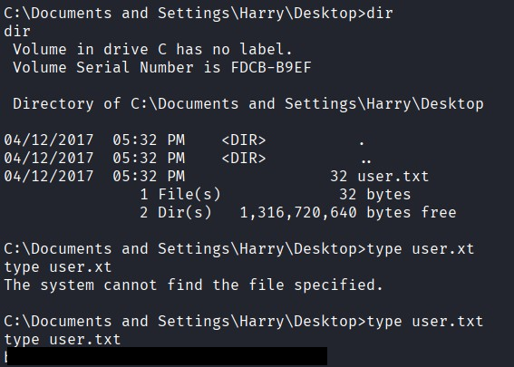

## Root Flag

`root.txt` sits on the Administrator's Desktop.

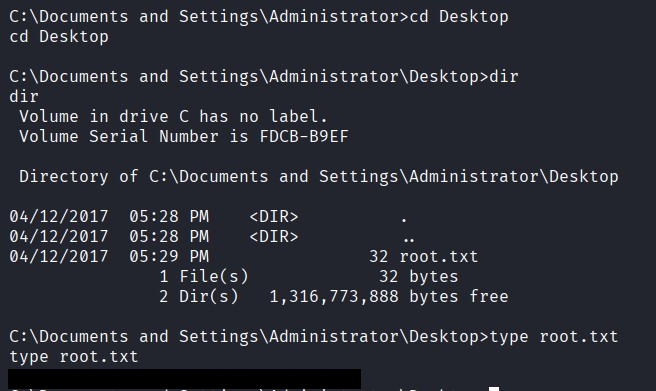

pwned

## Lessons Learned

- ScStoragePathFromUrl exploitation often produces unstable Meterpreter sessions because the buffer overflow corrupts the IIS worker process state. Re-running the module until a clean session lands - or immediately migrating to `w3wp.exe` - saves debugging time.
- The numeric column in `local_exploit_suggester` output is display-only. `use 3` after the suggester picks whatever module sits at global index 3, not the third suggested exploit. Always copy the full module path.
- KiTrap0D's `getsid` call fails in damaged Meterpreter contexts the same way `getuid` does. The fix is always process migration into a stable worker process under the same account.
- MS10-015 is one of the most reliable local privescs against legacy Windows boxes - covers 2000 SP4 through pre-patch Windows 7 - but it's x86-only because the `#GP` handler bug is in the 32-bit kernel.
- The IIS 6.0 + WebDAV + ScStoragePathFromUrl + KiTrap0D chain is the canonical Server 2003 path. Worth memorising for legacy network engagements.
