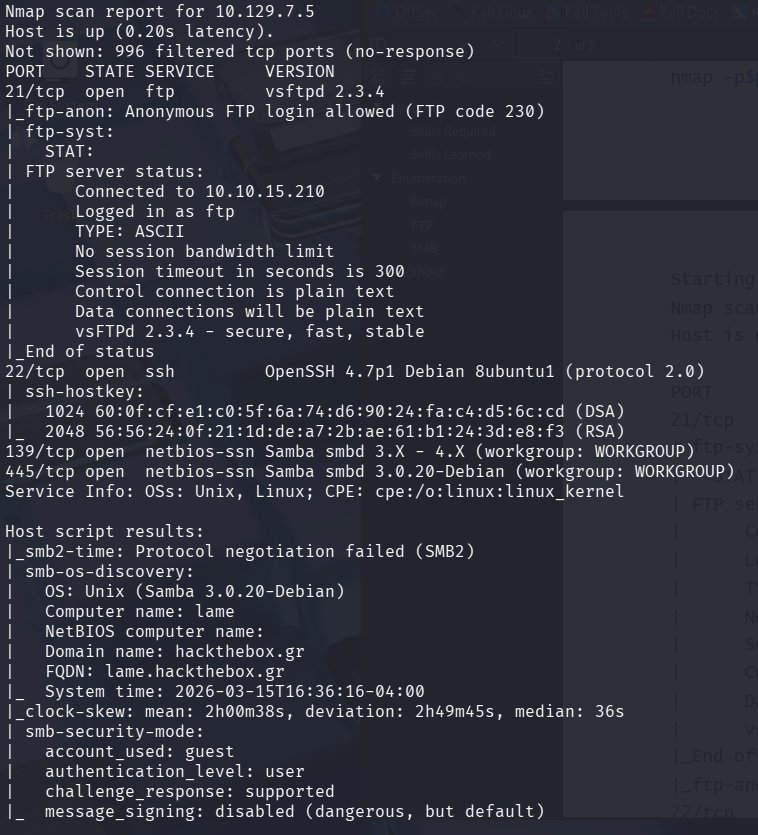
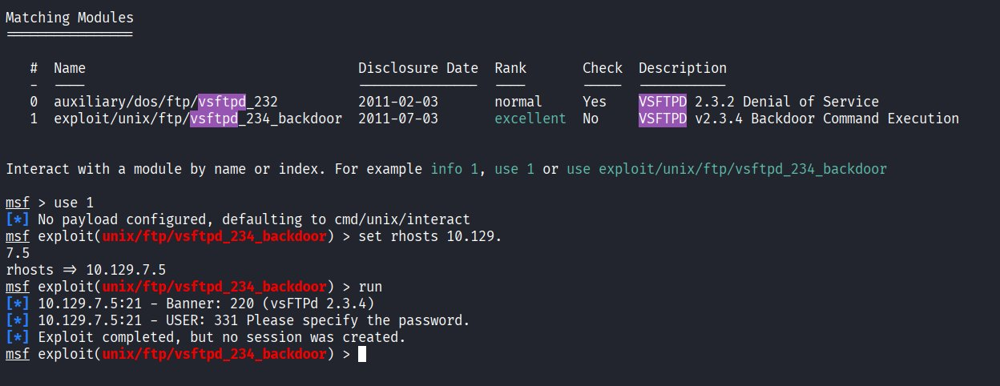
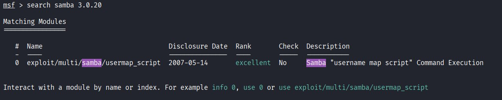
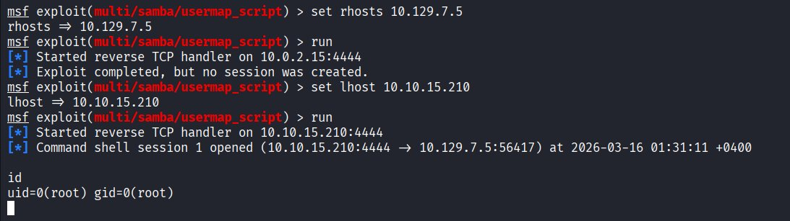
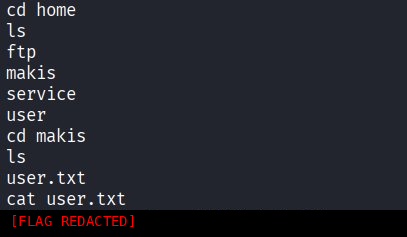

# Lame

## Overview

- **OS:** Linux
- **IP:** 10.129.7.5
- **Difficulty:** Easy
- **Platform:** HackTheBox

### Summary

vsftpd 2.3.4 backdoor failed, pivoted to Samba 3.0.20 usermap_script exploit for immediate root shell.

## Enumeration

Started with an nmap service and version scan.

FTP with anonymous login, SSH, and Samba 3.0.20 running. The vsftpd version 2.3.4 is known for a backdoor and Samba 3.0.20 has a known command execution vulnerability.

## Vulnerabilities

**PORT 21/tcp**

vsftpd 2.3.4 backdoor

https://www.rapid7.com/db/modules/exploit/unix/ftp/vsftpd_234_backdoor/

**PORT 445/tcp**

Samba smbd 3.0.20-Debian

**CVE-2007-2447** - allows remote attackers to execute arbitrary commands via shell metacharacters in the username field when the "username map script" smb.conf option is enabled.

## Exploitation

First tried the vsftpd 2.3.4 backdoor using Metasploit.

Exploit completed but no session was created. The backdoor was likely patched or the bind shell port is filtered. Moving on.

Searched for Samba 3.0.20 exploits.

Found the usermap_script module. First attempt failed because LHOST defaulted to a NAT interface. After fixing LHOST to the VPN tunnel address, it worked.

Root shell obtained. uid=0(root) gid=0(root). No privilege escalation needed.

## Flags

pwned
