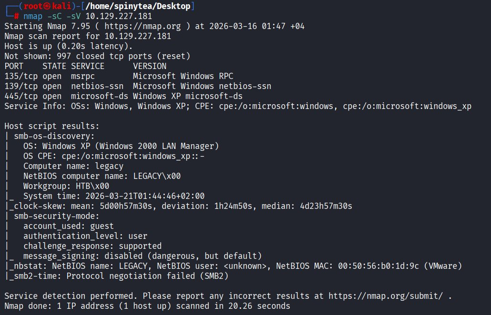
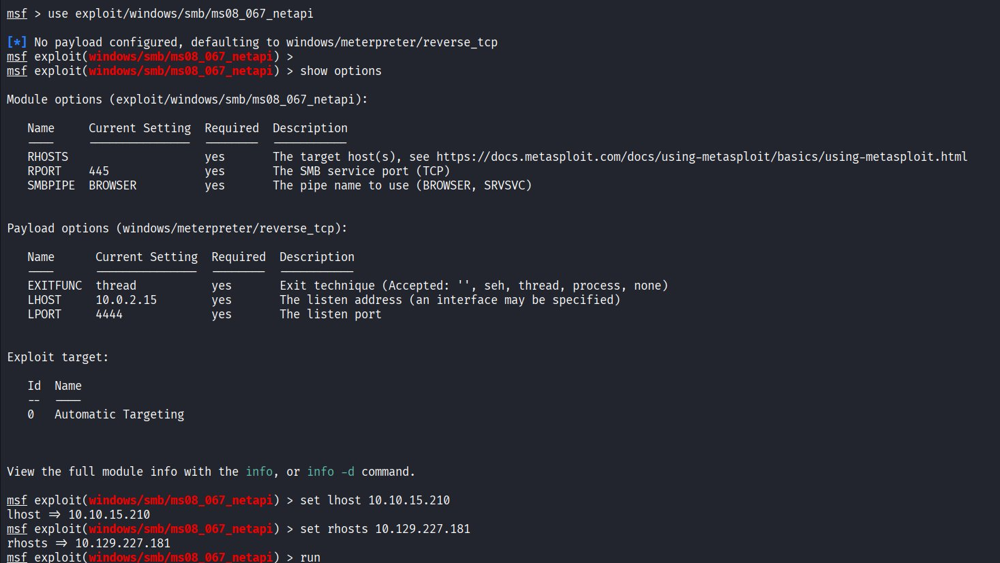
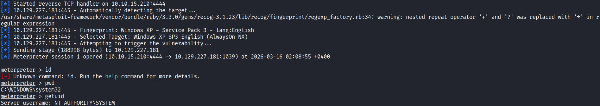
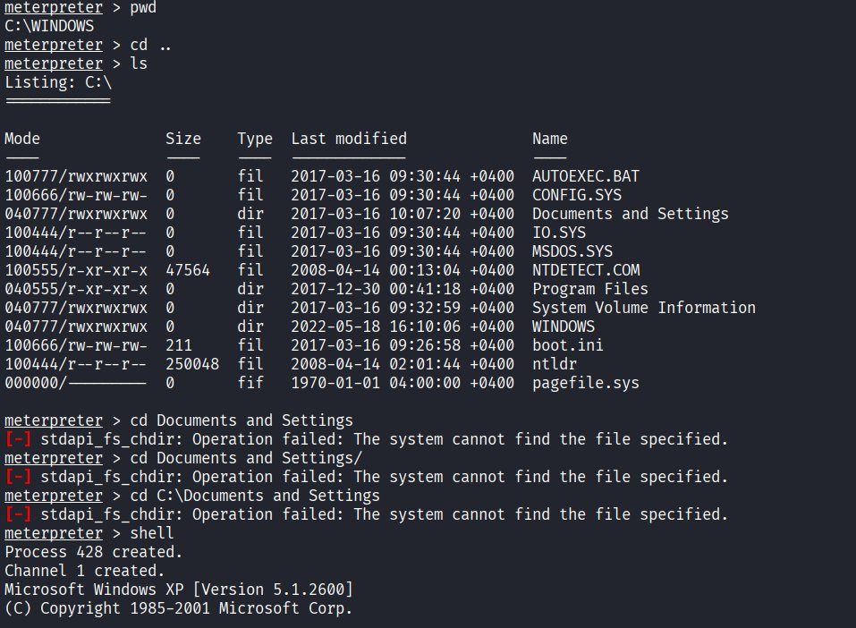
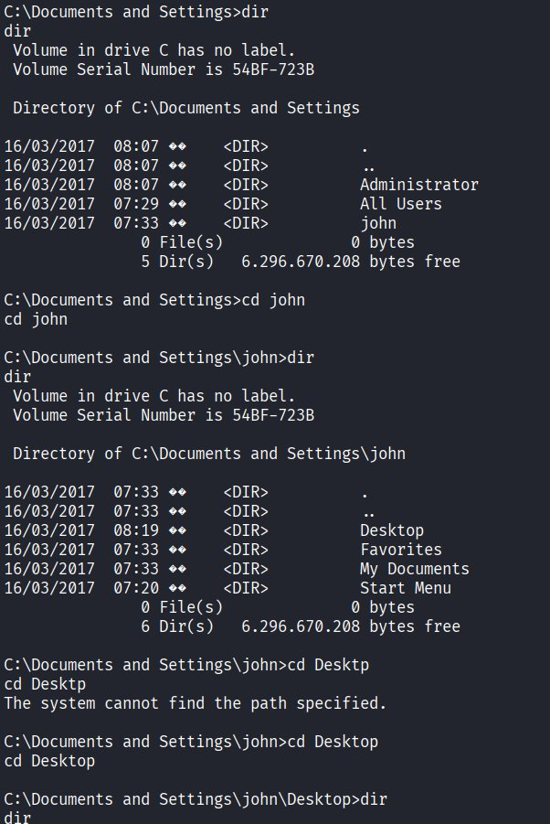
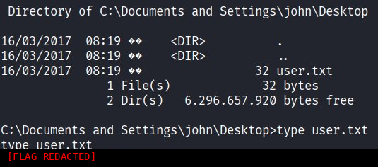
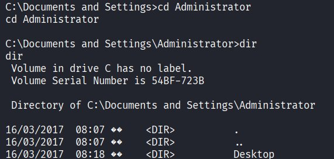
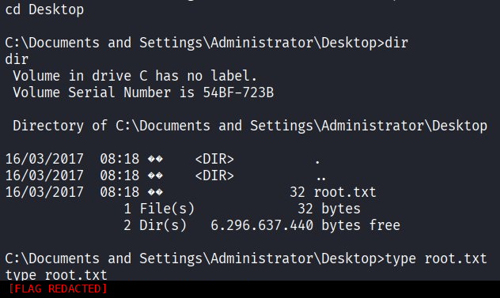

# Legacy

## Overview

- **OS:** Windows XP (Service Pack 3)
- **IP:** 10.129.227.181
- **Difficulty:** Easy
- **Platform:** HackTheBox

### Summary

Windows XP box with only SMB ports open. Exploited via MS08-067 for immediate SYSTEM shell.

## Enumeration

Started with an nmap service and version scan.

Only SMB-related ports open (135, 139, 445). OS identified as Windows XP with SMB2 negotiation failing, confirming a legacy system. The narrow attack surface makes MS08-067 the obvious candidate.

## Vulnerabilities

**PORT 445/tcp**

Windows XP microsoft-ds

**MS08-067 (CVE-2008-4250)** - critical vulnerability in the Windows Server service (netapi32.dll) that allows remote code execution through a specially crafted RPC request. Affects Windows XP, 2000, and Server 2003.

## Exploitation

Used the ms08_067_netapi Metasploit module. Set LHOST to VPN tunnel address and RHOSTS to target.

Metasploit fingerprinted the target as Windows XP SP3 English (AlwaysOn NX) and delivered a Meterpreter payload.

SYSTEM access confirmed via getuid. No privilege escalation needed.

## Post-Exploitation

Meterpreter cd command had issues with "Documents and Settings" path. Dropped into native Windows shell to navigate.

## Flags

### User Flag

### Root Flag

pwned
